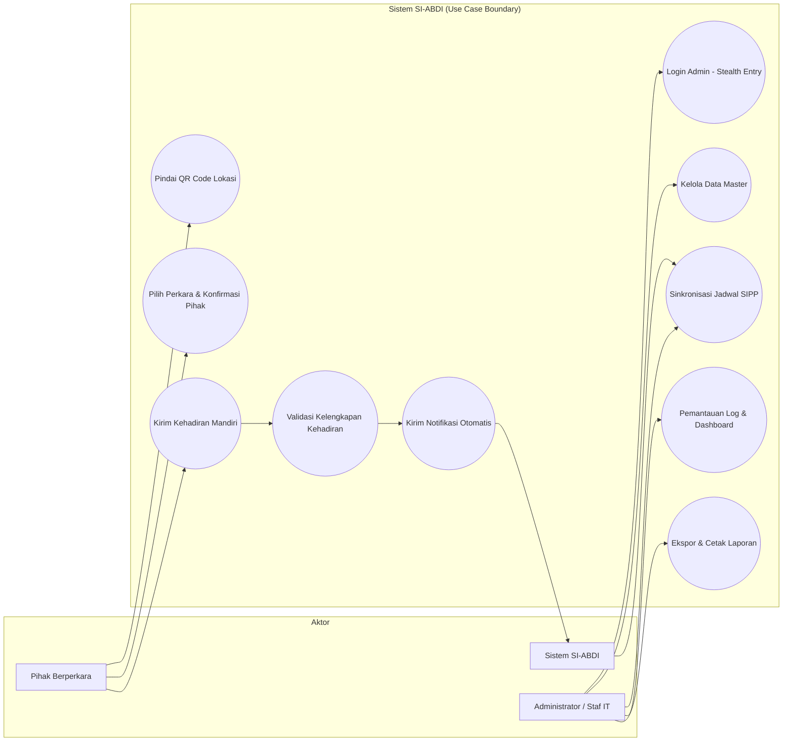
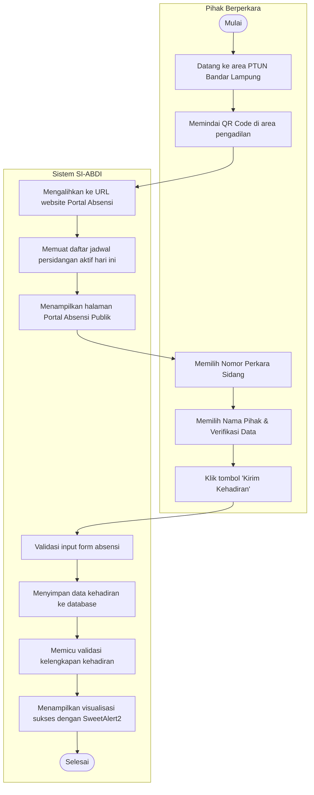
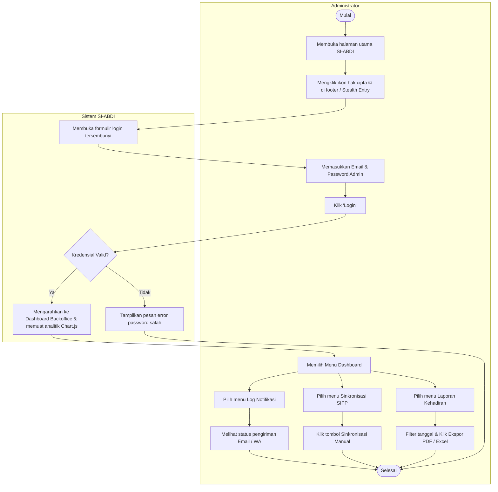
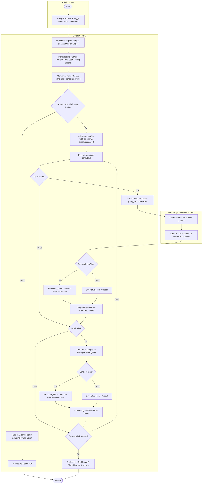
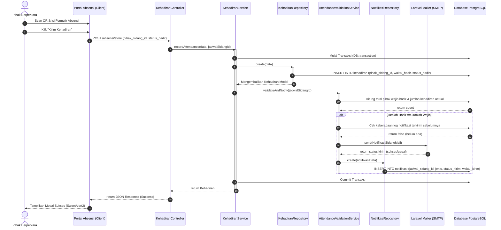

# DOKUMENTASI DIAGRAM PERANCANGAN SISTEM
## SI-ABDI (Sistem Absensi Mandiri & Monitoring Kehadiran Pihak Persidangan)
### PENGADILAN TATA USAHA NEGARA BANDAR LAMPUNG

Dokumen ini berisi spesifikasi teknis dan visualisasi diagram untuk perancangan sistem **SI-ABDI**. Diagram di bawah ini ditulis menggunakan format **Mermaid** yang valid, sehingga dapat dirender secara langsung pada visualizer Markdown (seperti VS Code, GitHub) atau diekspor ke aplikasi editor diagram lainnya.

---

## 1. DAFTAR AKTOR & ELEMEN SISTEM

Sebelum masuk ke diagram, berikut adalah aktor yang berinteraksi dengan sistem SI-ABDI:

| Aktor | Peran & Deskripsi |
| :--- | :--- |
| **Pihak Berperkara** | Pengguna publik (Penggugat, Tergugat, Kuasa Hukum, Saksi, atau Ahli) yang memindai QR Code di area pengadilan untuk melaporkan kehadiran mereka secara mandiri tanpa harus login (*Zero Login*). |
| **Administrator / Staf IT** | Pengguna internal pengadilan yang memiliki hak akses penuh untuk mengelola data master, menyinkronkan jadwal SIPP secara manual, memantau log kehadiran, memicu panggilan WhatsApp, dan mencetak laporan rekapitulasi. |
| **Sistem SI-ABDI (Internal)** | Layanan background sistem (seperti scheduler, email generator, dan validation service) yang berjalan otomatis untuk memproses kelengkapan data dan mengirimkan notifikasi. |

---

## 2. USE CASE DIAGRAM

Diagram Use Case menggambarkan hubungan antara aktor dengan fungsionalitas utama yang disediakan oleh aplikasi SI-ABDI.

### A. Visualisasi Diagram Use Case

### B. Deskripsi Use Case Utama

1. **Use Case: Absensi Mandiri Pihak**
   * **Deskripsi**: Pihak berperkara melaporkan kehadirannya dengan memindai QR Code menggunakan smartphone mereka di lokasi persidangan.
   * **Kondisi Awal**: Jadwal sidang hari ini sudah termuat di sistem.
   * **Kondisi Akhir**: Rekam kehadiran masuk ke database dan memicu validasi kelengkapan kehadiran.
   * **Alur**: Scan QR $\rightarrow$ Dialihkan ke halaman absensi $\rightarrow$ Pilih nomor perkara $\rightarrow$ Pilih nama pihak $\rightarrow$ Klik kirim.

2. **Use Case: Validasi & Notifikasi Otomatis**
   * **Deskripsi**: Sistem secara otomatis mendeteksi apakah para pihak persidangan dari suatu perkara sudah hadir 100%. Jika lengkap, sistem mengirimkan email pemberitahuan ke Majelis Hakim & PP.
   * **Kondisi Awal**: Pihak mengirim absensi mandiri.
   * **Kondisi Akhir**: Email siap sidang dikirim ke Hakim & PP, log terekam di tabel `notifikasi`.

3. **Use Case: Sinkronisasi Jadwal SIPP**
   * **Deskripsi**: Menarik data persidangan dari basis data SIPP PTUN Bandar Lampung menggunakan crawler.
   * **Kondisi Akhir**: Jadwal persidangan lokal sinkron dengan data SIPP.

---

## 3. ACTIVITY DIAGRAM

Activity diagram di bawah ini didefinisikan menggunakan **subgraph swimlanes** yang valid dalam sintaksis Mermaid.

### A. Activity Diagram: Absensi Mandiri Pihak
Diagram ini menunjukkan alur aktivitas pihak berperkara ketika melaporkan kehadirannya secara mandiri melalui pemindaian QR Code.

---

### B. Activity Diagram: Monitoring Kehadiran & Backoffice
Diagram ini menjelaskan bagaimana administrator mengakses dashboard backoffice melalui mekanisme masuk tersembunyi (*Stealth Entry*) dan melakukan tugas-tugas administratif.

---

### C. Activity Diagram: Notifikasi Panggilan WhatsApp (Manual Trigger)
Diagram ini menjelaskan alur pengiriman pesan panggilan sidang ke WhatsApp pihak berperkara (via Twilio API) saat administrator mengklik tombol "Panggil Pihak".

---

## 4. SEQUENCE DIAGRAM

Diagram urutan (*Sequence Diagram*) di bawah ini menggambarkan interaksi antarkomponen perangkat lunak saat pihak melakukan absensi mandiri, dilanjutkan dengan validasi kehadiran 100% dan pengiriman notifikasi otomatis.

---

## 5. PANDUAN REKAYASA & RENDERING DIAGRAM

Jika Anda ingin meregenerasi diagram ini ke dalam format gambar (PNG/SVG) atau ingin mengedit alurnya kembali, ikuti langkah-langkah praktis berikut:

### Metode A: Menggunakan Mermaid Live Editor (Sangat Direkomendasikan)
1. Buka browser dan akses **[Mermaid Live Editor](https://live.mermaid.live/)**.
2. Salin kode Mermaid di atas (mulai dari baris `graph ...`, `flowchart ...`, atau `sequenceDiagram ...` hingga baris akhir di dalam blok kode).
3. Tempelkan kode ke dalam kolom editor sebelah kiri (**Code**).
4. Diagram akan ter-render secara interaktif di panel sebelah kanan.
5. Klik menu **Actions** di bawah panel render untuk mengunduh gambar dalam format **PNG**, **SVG**, atau membagikan link diagram tersebut.

### Metode B: Menggunakan Draw.io (Integrasi ke Desain Laporan)
Jika Anda membutuhkan kustomisasi layout yang lebih fleksibel untuk laporan formal:
1. Buka situs **[Draw.io](https://app.diagrams.net/)**.
2. Buat diagram baru atau buka diagram kosong.
3. Pada baris menu atas, pilih **Arrange** $\rightarrow$ **Insert** $\rightarrow$ **Advanced** $\rightarrow$ **Mermaid...**
4. Tempelkan kode Mermaid dari dokumen ini ke dalam kotak input yang disediakan, lalu klik **Insert**.
5. Draw.io akan secara otomatis menerjemahkan kode Mermaid menjadi bentuk-bentuk diagram yang siap digeser, diwarnai, dan diedit secara visual.

### Metode C: Rendering Langsung di VS Code
Jika Anda menggunakan Visual Studio Code untuk mengedit file Markdown ini:
1. Pasang ekstensi **Markdown Preview Mermaid Support** atau **Markdown Preview Enhanced**.
2. Buka preview Markdown di VS Code (`Ctrl + Shift + V`).
3. Semua diagram di atas akan dirender secara langsung dan responsif sesuai tema editor Anda.
