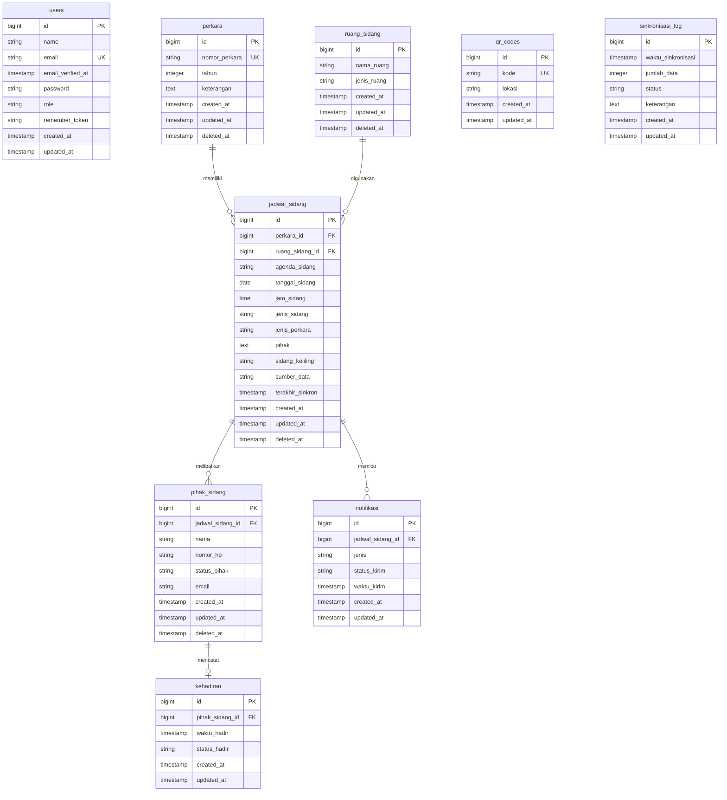

# DOKUMENTASI ENTITY RELATIONSHIP DIAGRAM (ERD)
## SI-ABDI (Sistem Absensi Mandiri & Monitoring Kehadiran Pihak Persidangan)
### PENGADILAN TATA USAHA NEGARA BANDAR LAMPUNG

Dokumen ini berisi spesifikasi teknis basis data PostgreSQL yang diimplementasikan pada aplikasi **SI-ABDI**, mencakup visualisasi Entity Relationship Diagram (ERD), penjelasan relasi antar tabel, kamus data (*data dictionary*) lengkap, serta panduan rendering diagram.

---

## 1. VISUALISASI ERD (MERMAID DIAGRAM)

Berikut adalah struktur hubungan antarentitas dalam sistem basis data SI-ABDI. Diagram ditulis menggunakan standar sintaksis **Mermaid ERD** yang valid.

---

## 2. RELASI ANTAR TABEL & ATURAN INTEGRITAS

Berikut adalah detail relasi antar tabel beserta aturan integritas data yang dikonfigurasi melalui migrasi Laravel:

### A. Perkara ke Jadwal Sidang (One-to-Many)
* **Kunci Relasi**: `jadwal_sidang.perkara_id` merujuk ke `perkara.id`.
* **Karakteristik**: Satu perkara dapat disidangkan beberapa kali (misalnya sidang dismissal, pembuktian, putusan), namun satu catatan jadwal persidangan hanya merujuk pada satu perkara yang terdaftar.
* **Integritas (Cascade)**: Dikonfigurasi dengan `onDelete('cascade')`. Jika data perkara dihapus, seluruh riwayat jadwal sidang terkait akan ikut terhapus secara otomatis guna menghindari data yatim (*orphan data*).

### B. Ruang Sidang ke Jadwal Sidang (One-to-Many)
* **Kunci Relasi**: `jadwal_sidang.ruang_sidang_id` merujuk ke `ruang_sidang.id`.
* **Karakteristik**: Satu ruangan sidang fisik dapat digunakan secara bergantian untuk melaksanakan banyak jadwal sidang, namun satu jadwal sidang hanya dialokasikan di satu ruangan pada waktu tersebut.
* **Integritas (Cascade)**: Menggunakan `onDelete('cascade')`. Jika ruang sidang dihapus dari master, jadwal sidang terkait ikut terhapus.

### C. Jadwal Sidang ke Pihak Sidang (One-to-Many)
* **Kunci Relasi**: `pihak_sidang.jadwal_sidang_id` merujuk ke `jadwal_sidang.id`.
* **Karakteristik**: Satu jadwal persidangan melibatkan daftar pihak wajib hadir (seperti Penggugat, Tergugat, Saksi, Ahli). Anggota roster pihak terikat langsung pada jadwal persidangan spesifik tersebut.
* **Integritas (Cascade)**: Menggunakan `onDelete('cascade')`. Jika sebuah jadwal sidang dihapus, daftar pihak yang dijadwalkan pada sidang itu juga otomatis terhapus.

### D. Jadwal Sidang ke Notifikasi (One-to-Many)
* **Kunci Relasi**: `notifikasi.jadwal_sidang_id` merujuk ke `jadwal_sidang.id`.
* **Karakteristik**: Satu jadwal sidang dapat memicu beberapa pengiriman notifikasi (Email ke Hakim/PP atau WhatsApp Panggilan ke Pihak).
* **Integritas (Cascade)**: Menggunakan `onDelete('cascade')`. Penghapusan jadwal sidang akan membersihkan seluruh riwayat audit log notifikasinya.

### E. Pihak Sidang ke Kehadiran (One-to-One / One-to-Zero)
* **Kunci Relasi**: `kehadiran.pihak_sidang_id` merujuk ke `pihak_sidang.id`.
* **Karakteristik**: Satu entitas pihak sidang yang terdaftar pada jadwal persidangan hanya dapat melakukan konfirmasi check-in kehadiran maksimal satu kali. Oleh karena itu, kunci `pihak_sidang_id` pada tabel kehadiran bersifat unik.
* **Integritas (Cascade)**: Menggunakan `onDelete('cascade')`. Jika data pihak sidang dihapus, log kehadirannya akan ikut terhapus secara otomatis.

---

## 3. KAMUS DATA (DATA DICTIONARY)

Berikut adalah detail teknis kamus data PostgreSQL untuk aplikasi SI-ABDI:

### 1. Tabel: `users`
Menyimpan data akun kredensial administrator/petugas IT pengadilan.
* **Soft Deletes**: Tidak diterapkan.

| Nama Kolom | Tipe Data | Constraints | Keterangan |
| :--- | :--- | :--- | :--- |
| `id` | bigint | PRIMARY KEY, AUTO_INCREMENT | ID unik akun user. |
| `name` | varchar(255) | NOT NULL | Nama lengkap pengguna. |
| `email` | varchar(255) | UNIQUE, NOT NULL | Alamat email (digunakan untuk login). |
| `email_verified_at`| timestamp | NULLABLE | Waktu verifikasi email. |
| `password` | varchar(255) | NOT NULL | Hash kata sandi akun (Bcrypt). |
| `role` | varchar(50) | NOT NULL | Peran/hak akses user (misal: 'admin'). |
| `remember_token` | varchar(100) | NULLABLE | Token sesi login persisten (*remember me*). |
| `created_at` | timestamp | NULLABLE | Tanggal & waktu record dibuat. |
| `updated_at` | timestamp | NULLABLE | Tanggal & waktu record diperbarui. |

### 2. Tabel: `perkara`
Menyimpan master nomor perkara yang terdaftar di Pengadilan.
* **Soft Deletes**: Diterapkan (`deleted_at`).

| Nama Kolom | Tipe Data | Constraints | Keterangan |
| :--- | :--- | :--- | :--- |
| `id` | bigint | PRIMARY KEY, AUTO_INCREMENT | ID unik perkara. |
| `nomor_perkara` | varchar(255) | UNIQUE, NOT NULL | Nomor registrasi perkara di pengadilan. |
| `tahun` | integer | NOT NULL | Tahun pendaftaran perkara. |
| `keterangan` | text | NULLABLE | Informasi atau keterangan tambahan perkara. |
| `created_at` | timestamp | NULLABLE | Tanggal & waktu record dibuat. |
| `updated_at` | timestamp | NULLABLE | Tanggal & waktu record diperbarui. |
| `deleted_at` | timestamp | NULLABLE | Waktu record dihapus secara logis (Soft Delete). |

### 3. Tabel: `ruang_sidang`
Menyimpan daftar master ruang persidangan fisik.
* **Soft Deletes**: Diterapkan (`deleted_at`).

| Nama Kolom | Tipe Data | Constraints | Keterangan |
| :--- | :--- | :--- | :--- |
| `id` | bigint | PRIMARY KEY, AUTO_INCREMENT | ID unik ruangan. |
| `nama_ruang` | varchar(255) | NOT NULL | Nama ruang sidang (misal: 'Ruang Cakra'). |
| `jenis_ruang` | varchar(100) | NOT NULL | Kategori ruang (misal: 'Ruang Sidang Utama'). |
| `created_at` | timestamp | NULLABLE | Tanggal & waktu record dibuat. |
| `updated_at` | timestamp | NULLABLE | Tanggal & waktu record diperbarui. |
| `deleted_at` | timestamp | NULLABLE | Waktu record dihapus secara logis (Soft Delete). |

### 4. Tabel: `jadwal_sidang`
Menyimpan detail informasi jadwal persidangan harian.
* **Soft Deletes**: Diterapkan (`deleted_at`).

| Nama Kolom | Tipe Data | Constraints | Keterangan |
| :--- | :--- | :--- | :--- |
| `id` | bigint | PRIMARY KEY, AUTO_INCREMENT | ID unik jadwal sidang. |
| `perkara_id` | bigint | FOREIGN KEY (`perkara.id`) | Relasi ke tabel `perkara` (Cascade). |
| `ruang_sidang_id` | bigint | FOREIGN KEY (`ruang_sidang.id`) | Relasi ke tabel `ruang_sidang` (Cascade). |
| `agenda_sidang` | varchar(255) | NOT NULL | Agenda sidang (Dismissal, Pembuktian, dll.). |
| `tanggal_sidang` | date | NOT NULL | Tanggal persidangan dilaksanakan. |
| `jam_sidang` | time | NOT NULL | Waktu mulai persidangan. |
| `jenis_sidang` | varchar(50) | NOT NULL | Kategori sidang (Offline / Online). |
| `jenis_perkara` | varchar(255) | NULLABLE | Klasifikasi hukum perkara. |
| `pihak` | text | NULLABLE | Teks rangkuman nama para pihak persidangan. |
| `sidang_keliling` | varchar(255) | NULLABLE | Informasi persidangan di luar kantor pengadilan. |
| `sumber_data` | varchar(50) | DEFAULT 'SIPP' | Asal data jadwal ('SIPP' / 'Manual'). |
| `terakhir_sinkron`| timestamp | NULLABLE | Waktu terakhir sinkronisasi parser. |
| `created_at` | timestamp | NULLABLE | Tanggal & waktu record dibuat. |
| `updated_at` | timestamp | NULLABLE | Tanggal & waktu record diperbarui. |
| `deleted_at` | timestamp | NULLABLE | Waktu record dihapus secara logis (Soft Delete). |

### 5. Tabel: `pihak_sidang`
Daftar nama individu berperkara yang diwajibkan hadir pada suatu jadwal persidangan.
* **Soft Deletes**: Diterapkan (`deleted_at`).

| Nama Kolom | Tipe Data | Constraints | Keterangan |
| :--- | :--- | :--- | :--- |
| `id` | bigint | PRIMARY KEY, AUTO_INCREMENT | ID unik pihak persidangan. |
| `jadwal_sidang_id`| bigint | FOREIGN KEY (`jadwal_sidang.id`) | Relasi ke tabel `jadwal_sidang` (Cascade). |
| `nama` | varchar(255) | NOT NULL | Nama lengkap pihak. |
| `nomor_hp` | varchar(50) | NOT NULL | Nomor WhatsApp untuk pengiriman notifikasi. |
| `status_pihak` | varchar(100) | NOT NULL | Peran pihak (Penggugat, Tergugat, Saksi, dll.). |
| `email` | varchar(255) | NULLABLE | Alamat email pihak. |
| `created_at` | timestamp | NULLABLE | Tanggal & waktu record dibuat. |
| `updated_at` | timestamp | NULLABLE | Tanggal & waktu record diperbarui. |
| `deleted_at` | timestamp | NULLABLE | Waktu record dihapus secara logis (Soft Delete). |

### 6. Tabel: `qr_codes`
Data kode identifikasi QR Code lokasi pemindaian fisik.
* **Soft Deletes**: Tidak diterapkan.

| Nama Kolom | Tipe Data | Constraints | Keterangan |
| :--- | :--- | :--- | :--- |
| `id` | bigint | PRIMARY KEY, AUTO_INCREMENT | ID unik kode QR. |
| `kode` | varchar(255) | UNIQUE, NOT NULL | String hash/kode unik (misal: 'QR-LOBBY'). |
| `lokasi` | varchar(255) | NOT NULL | Nama lokasi penempelan fisik (misal: 'Lobby Utama'). |
| `created_at` | timestamp | NULLABLE | Tanggal & waktu record dibuat. |
| `updated_at` | timestamp | NULLABLE | Tanggal & waktu record diperbarui. |

### 7. Tabel: `notifikasi`
Audit log riwayat pengiriman notifikasi persidangan (Email/WhatsApp).
* **Soft Deletes**: Tidak diterapkan.

| Nama Kolom | Tipe Data | Constraints | Keterangan |
| :--- | :--- | :--- | :--- |
| `id` | bigint | PRIMARY KEY, AUTO_INCREMENT | ID unik log notifikasi. |
| `jadwal_sidang_id`| bigint | FOREIGN KEY (`jadwal_sidang.id`) | Relasi ke tabel `jadwal_sidang` (Cascade). |
| `jenis` | varchar(50) | NOT NULL | Jalur pengiriman ('Email' / 'WhatsApp'). |
| `status_kirim` | varchar(50) | NOT NULL | Status status pengiriman ('terkirim' / 'gagal'). |
| `waktu_kirim` | timestamp | NULLABLE | Tanggal & waktu tepat pengiriman pesan dilakukan. |
| `created_at` | timestamp | NULLABLE | Tanggal & waktu record dibuat. |
| `updated_at` | timestamp | NULLABLE | Tanggal & waktu record diperbarui. |

### 8. Tabel: `kehadiran`
Menyimpan rekaman presensi fisik mandiri para pihak berperkara.
* **Soft Deletes**: Tidak diterapkan.

| Nama Kolom | Tipe Data | Constraints | Keterangan |
| :--- | :--- | :--- | :--- |
| `id` | bigint | PRIMARY KEY, AUTO_INCREMENT | ID unik presensi. |
| `pihak_sidang_id` | bigint | UNIQUE, FOREIGN KEY (`pihak_sidang.id`) | Relasi satu-satu ke `pihak_sidang` (Cascade). |
| `waktu_hadir` | timestamp | NOT NULL | Waktu tepat pihak melakukan check-in mandiri. |
| `status_hadir` | varchar(50) | NOT NULL | Status kehadiran (misal: 'hadir'). |
| `created_at` | timestamp | NULLABLE | Tanggal & waktu record dibuat. |
| `updated_at` | timestamp | NULLABLE | Tanggal & waktu record diperbarui. |

### 9. Tabel: `sinkronisasi_log`
Audit log riwayat penarikan data sinkronisasi otomatis dari server SIPP.
* **Soft Deletes**: Tidak diterapkan.

| Nama Kolom | Tipe Data | Constraints | Keterangan |
| :--- | :--- | :--- | :--- |
| `id` | bigint | PRIMARY KEY, AUTO_INCREMENT | ID unik log sinkronisasi. |
| `waktu_sinkronisasi`| timestamp | NOT NULL | Waktu penarikan data dieksekusi. |
| `jumlah_data` | integer | NOT NULL | Jumlah baris jadwal baru yang ditambahkan/diperbarui. |
| `status` | varchar(50) | NOT NULL | Hasil penarikan ('berhasil' / 'gagal'). |
| `keterangan` | text | NULLABLE | Pesan rincian sukses atau detail stack trace error. |
| `created_at` | timestamp | NULLABLE | Tanggal & waktu record dibuat. |
| `updated_at` | timestamp | NULLABLE | Tanggal & waktu record diperbarui. |

---

## 4. PANDUAN EKSPOR DAN RENDERING ERD

Untuk memvisualisasikan ERD ini ke dalam diagram grafis yang siap dilampirkan pada laporan cetak:

### Opsi 1: Menggunakan Mermaid Live Editor (Ekspor PNG/SVG)
1. Buka **[Mermaid Live Editor](https://live.mermaid.live/)**.
2. Salin kode Mermaid yang ada di bagian **1. VISUALISASI ERD** di atas.
3. Tempelkan ke editor kode di panel sebelah kiri.
4. Diagram ERD interaktif akan termuat di sebelah kanan. Anda dapat mengunduhnya dengan mengeklik **PNG** atau **SVG** pada menu **Actions**.

### Opsi 2: Menggunakan Draw.io (Pengeditan Manual)
1. Buka **[Draw.io](https://app.diagrams.net/)**.
2. Klik **Arrange** $\rightarrow$ **Insert** $\rightarrow$ **Advanced** $\rightarrow$ **Mermaid...** pada menu bar atas.
3. Tempelkan kode Mermaid ERD tersebut ke dalam kolom input dan klik **Insert**.
4. Komponen tabel beserta garis relasinya akan langsung terbentuk di workspace Draw.io Anda sebagai elemen grafis biasa yang bisa diwarnai, diubah fontnya, atau digeser.
