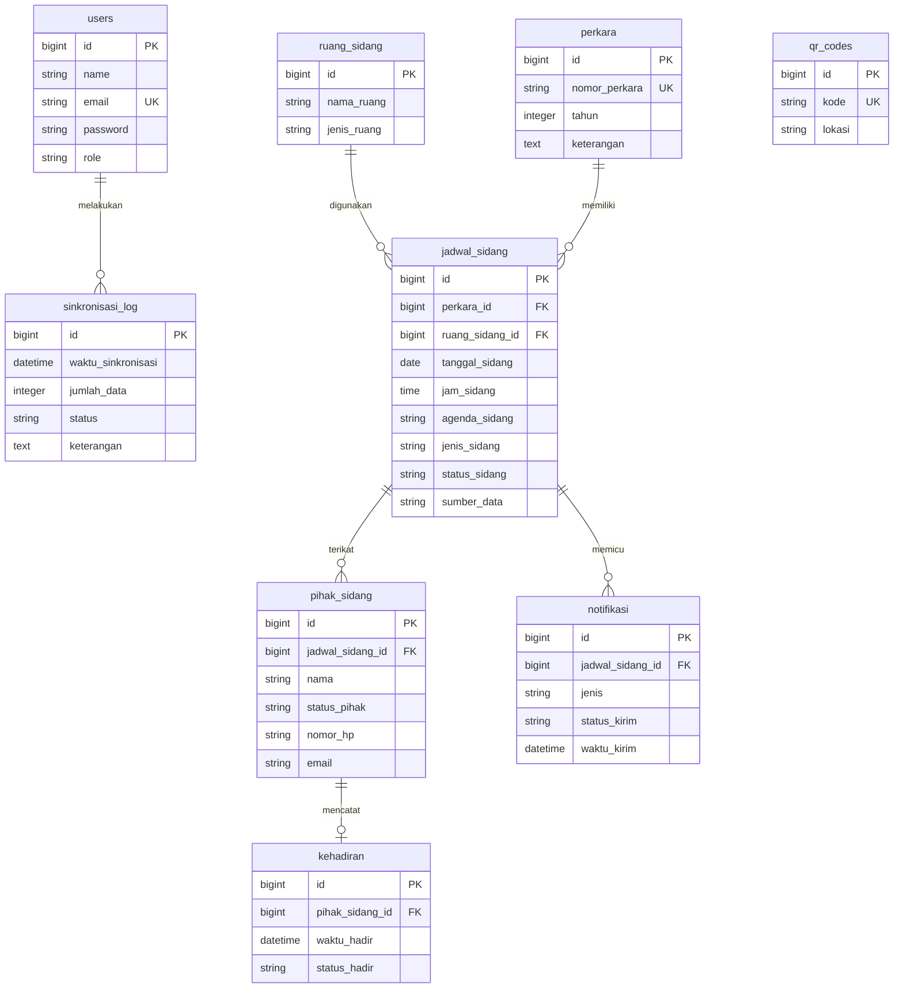

#  SIPEKA — Sistem Absensi & Monitoring Kehadiran Pihak Persidangan Berbasis Web
### Pengadilan Tata Usaha Negara (PTUN) Bandar Lampung

---


---

##  Judul Resmi Kerja Praktik

> **"Pengembangan Sistem Absensi dan Monitoring Kehadiran Pihak Berperkara pada Persidangan PTUN Berbasis Web dengan Integrasi Jadwal Sidang SIPP"**

**Lokasi Pelaksanaan**: Pengadilan Tata Usaha Negara (PTUN) Bandar Lampung  
**Instansi Institusional**: Mahkamah Agung Republik Indonesia  

---

##  Latar Belakang & Perumusan Masalah

Pada pelaksanaan persidangan di **Pengadilan Tata Usaha Negara (PTUN) Bandar Lampung**, ditemukan permasalahan di mana beberapa pihak berperkara (Penggugat, Tergugat, Saksi, Ahli, maupun Kuasa Hukum) yang telah melakukan absensi kedatangan **sering meninggalkan ruang tunggu** sebelum persidangan dimulai. Kondisi tersebut mengharuskan petugas pengadilan kembali memanggil atau mencari pihak yang bersangkutan secara manual di area gedung pengadilan, sehingga pelaksanaan persidangan berpotensi mengalami keterlambatan.

Di sisi lain, **Majelis Hakim dan Panitera Pengganti belum dapat memantau status kehadiran seluruh pihak secara langsung** melalui suatu sistem yang terintegrasi. Hal ini menyebabkan ketidakpastian kepastian kehadiran pihak yang wajib hadir sebelum Majelis Hakim memasuki ruang sidang.

Berdasarkan permasalahan tersebut, dikembangkan sistem berbasis web bernama **SIPEKA / SI-ABDI** yang mengintegrasikan proses absensi mandiri dengan data jadwal persidangan dari **Sistem Informasi Penelusuran Perkara (SIPP)**. Sistem memanfaatkan teknologi **QR Code** sebagai media akses menuju halaman absensi web sehingga pihak dapat absen mandiri tanpa perlu mendaftar akun. Data kehadiran direkam dan disajikan pada **Dashboard Monitoring Real-Time** untuk pemantauan Majelis Hakim dan Panitera Pengganti. Sistem juga dilengkapi **Notifikasi WhatsApp Otomatis (Twilio API Gateway)** sebagai panggilan persidangan instan dan pengingat agar pihak tetap berada di area pengadilan.

---

##  Tujuan & Manfaat Sistem

### A. Tujuan Pengembangan
1. **Digitalisasi Presensi Mandiri**: Menyediakan media absensi mandiri berbasis QR Code yang cepat, aman, dan tanpa prosedur login yang rumit bagi masyarakat.
2. **Monitoring Terintegrasi Real-Time**: Menyajikan dashboard pemantauan kelengkapan pihak persidangan bagi Majelis Hakim dan Panitera Pengganti.
3. **Otomatisasi Panggilan Sidang**: Memfasilitasi panggilan persidangan langsung ke WhatsApp HP pihak yang terikat pada perkara tersebut.
4. **Integrasi Data SIPP**: Menghubungkan data persidangan lokal secara otomatis dengan SIPP tanpa perlu entri ganda (*double entry*).

### B. Manfaat Sistem
* **Bagi Masyarakat / Pihak Berperkara**: Memudahkan proses check-in dan memberikan kepastian panggilan persidangan langsung melalui handphone.
* **Bagi Majelis Hakim & Panitera Pengganti**: Mengetahui kepastian kehadiran pihak secara transparan dan *real-time* sebelum memasuki ruang sidang.
* **Bagi Institusi PTUN Bandar Lampung**: Meningkatkan efektivitas persidangan, mencegah penumpukan antrean di ruang tunggu, serta mendukung terwujudnya Zona Integritas (WBK/WBBM) dan asas peradilan yang cepat, sederhana, dan berbiaya ringan.

---

##  Fitur-Fitur Utama Sistem

```
+-----------------------------------------------------------------------------------+
|                              MODUL UTAMA SIPEKA / SI-ABDI                         |
+------------------------------------+----------------------------------------------+
| 1. Portal Absensi QR Code (Publik) | Scan QR ➔ Auto-Prefill ➔ Check-In Real-time  |
| 2. Dashboard Monitoring (Realtime) | Auto-Polling 2s ➔ TV Fullscreen ➔ Status Color|
| 3. WA Gateway (Twilio API)         | Broadcast Panggilan ➔ Pengingat H-1 ➔ Anti-Grat|
| 4. Integrasi SIPP (SippSync)       | Crawler SIPP ➔ Past 7 Days & Future 10 Days  |
| 5. Laporan & Ekspor Data           | Penapisan Tanggal ➔ Ekspor PDF & Excel       |
| 6. Keamanan & Stealth Admin        | Stealth Login Footer (©) ➔ Safe Seeder       |
+------------------------------------+----------------------------------------------+
```

### 1.  Portal Absensi Mandiri QR Code (Zero Login)
* **Scan QR Code Multi-Lokasi**: Pihak berperkara cukup memindai QR Code yang dipasang pada lokasi strategis (Pos Satpam, PTSP, Ruang Tunggu).
* **Zero Login & Zero Password**: Publik tidak memerlukan pendaftaran akun atau autentikasi password.
* **Deteksi Lokasi & Prefill Otomatis**: Form absensi mengenali titik lokasi QR Code dan menyaring daftar jadwal persidangan hari itu secara dinamis.
* **Bukti Check-In Digital**: Menerbitkan tanda centang hijau digital beserta rincian nomor perkara, jam presisi check-in, dan nama ruang sidang.

### 2.  Dashboard Monitoring Real-Time & Layar TV Display
* **Auto-Polling Real-Time**: Pembaruan data kehadiran secara otomatis setiap 2 detik tanpa perlu me-refresh peramban.
* **Indikator Visual Status Sidang**:
  * 🟢 **Warna Hijau (`SIDANG BERLANGSUNG`)**: Diaktifkan saat persidangan dibuka oleh Majelis Hakim. Tampilan kartu menyala hijau dengan indikator berkedip.
  * 🔴 **Warna Merah (`SIDANG SELESAI`)**: Diaktifkan saat persidangan ditutup. Kartu berubah merah sebagai penanda sidang telah selesai.
* **Fitur Monitoring Ruang Tunggu**:
  * **Auto-Scroll Looping**: Perguliran layar otomatis untuk menampilkan seluruh perkara hari tersebut di monitor TV ruang tunggu.
  * **Hover Auto-Pause**: Perguliran scroll berhenti otomatis saat kursor mouse diarahkan ke kartu perkara untuk menjaga akurasi klik tombol aksi.
  * **Mode Layar Penuh (Fullscreen)**: Memaksimalkan tampilan TV monitor dengan menyembunyikan elemen navigasi.

### 3.  Otomatisasi Notifikasi & Panggilan Sidang Hari-H (WhatsApp & Email)
* **Panggilan Persidangan Hari-H (Real-Time)**: Dikirimkan pada hari persidangan ketika petugas admin memicu tombol *"Panggil Pihak"*. Notifikasi terkirim secara serentak via **WhatsApp (Twilio API Gateway)** dan **Email** ke seluruh pihak terdaftar pada perkara tersebut.
* **Solusi Pihak Meninggalkan Ruang Tunggu**: Memastikan panggilan persidangan langsung diterima di HP & Email pihak meskipun mereka sedang berada di luar ruang tunggu gedung pengadilan.
* **Pesan Anti-Gratifikasi**: Mengintegrasikan himbauan penolakan tip/gratifikasi khas institusi peradilan pada bagian footer pesan WhatsApp.

### 4.  Integrasi & Sinkronisasi SIPP (`SippSyncService`)
* **Pencolokan Data Otomatis**: Menarik data Perkara, Jadwal Sidang, Ruang Sidang, Jenis Perkara, dan Pihak langsung dari portal SIPP PTUN Bandar Lampung.
* **Rentang Hari Fleksibel**: Mampu melakukan *crawling* data persidangan dari **hari ini** hingga **10 hari ke depan**.
* **Pencegahan Double Entry**: Mengeliminasi penginputan data secara manual oleh petugas admin.

### 5.  Modul Pelaporan & Ekspor Data
* **Penapisan Fleksibel**: Menyaring data kehadiran berdasarkan Rentang Tanggal, Status Kehadiran, dan Ruang Sidang.
* **Ekspor Multi-Format**:
  * **Cetak PDF**: Mengunduh berkas laporan cetak PDF berformat resmi via `DomPDF`.
  * **Ekspor Excel**: Mengunduh data mentah berformat `.xlsx` via `Laravel Excel`.

### 6.  Keamanan & Stealth Admin Entry
* **Stealth Admin Login**: Tombol login administrator disembunyikan secara khusus pada karakter hak cipta **`©`** di footer halaman publik (`/login`).
* **Proteksi Data Seeder (`firstOrCreate`)**: Berkas `DatabaseSeeder.php` dikonfigurasi tanpa perintah `delete()`, sehingga aman dari penghapusan data riil saat seeder dijalankan.

---

##  Spesifikasi Teknologi (Tech Stack)

| Lapisan | Teknologi / Dependensi | Fungsi / Peran |
| :--- | :--- | :--- |
| **Backend Core** | PHP `^8.2` & Laravel `10.x` | Framework utama (MVC, Eloquent ORM, Routing, Artisan CLI) |
| **Starter Kit** | Laravel Breeze | Manajamen autentikasi admin & keamanan sesi |
| **Database** | PostgreSQL | Relational DBMS teroptimasi dengan integritas foreign key |
| **Frontend UI** | HTML5, Vanilla CSS, Bootstrap 5 | Layout responsif & ramah perangkat seluler |
| **Tema Desain** | Custom Emerald Green & Brass Gold | Identitas visual peradilan modern (Glassmorphism UI & Dark Mode) |
| **WA Gateway** | Twilio WhatsApp API Gateway | Layanan pengiriman notifikasi & panggilan sidang via WhatsApp |
| **SIPP Crawler** | Symfony DomCrawler (`symfony/dom-crawler`) | Engine pengurai HTML & *web scraping* portal SIPP |
| **HTTP Client** | Laravel Http Facade (Guzzle) | Komunikasi API dengan Twilio & HTTP request SIPP |
| **PDF Generator** | DomPDF (`barryvdh/laravel-dompdf`) | Generator berkas cetak laporan PDF |
| **Excel Generator** | Laravel Excel (`maatwebsite/excel`) | Generator berkas ekspor laporan spreadsheet `.xlsx` |
| **Statistik & UI** | Chart.js & SweetAlert2 | Grafik analitik dashboard & dialog konfirmasi interaktif |

---

##  Skema Basis Data (Database Entities)

Sistem menggunakan database PostgreSQL dengan 9 entitas utama:



---

##  Struktur Direktori Proyek

```
absen-sidang/
├── app/
│   ├── Console/Commands/
│   │   ├── SendJadwalReminder.php      # Command pengingat persidangan H-1 (WA Twilio & Email)
│   │   └── SippSyncCommand.php         # Command sinkronisasi SIPP (--days-back=7 --days-forward=10)
│   ├── Http/Controllers/
│   │   ├── Admin/
│   │   │   ├── DashboardController.php # Controller dashboard utama & statistik
│   │   │   ├── JadwalSidangController.php # Controller jadwal & pemicu panggilan WA
│   │   │   ├── LaporanController.php    # Controller cetak laporan PDF & Excel
│   │   │   ├── NotifikasiController.php # Controller audit log notifikasi
│   │   │   ├── PerkaraController.php    # Controller CRUD data perkara
│   │   │   ├── RuangSidangController.php# Controller CRUD ruang sidang
│   │   │   └── SippController.php       # Controller manajemen sinkronisasi SIPP
│   │   ├── AttendanceController.php    # Controller portal absensi mandiri publik
│   │   └── ProfileController.php       # Controller manajemen profil admin
│   ├── Models/
│   │   ├── User.php
│   │   ├── Perkara.php
│   │   ├── RuangSidang.php
│   │   ├── JadwalSidang.php
│   │   ├── PihakSidang.php
│   │   ├── Kehadiran.php
│   │   ├── QrCode.php
│   │   ├── Notifikasi.php
│   │   └── SinkronisasiLog.php
│   └── Services/
│       ├── AttendanceValidationService.php  # Service validasi kelengkapan pihak & auto-notif
│       ├── SippSyncService.php              # Service crawler & parser HTML SIPP
│       └── WhatsAppNotificationService.php  # Service gateway notifikasi Twilio API
├── config/
│   ├── services.php                    # Konfigurasi kredensial Twilio & Mailgun
│   └── database.php                    # Konfigurasi koneksi PostgreSQL
├── database/
│   ├── migrations/                     # Skema migrasi database PostgreSQL
│   └── seeders/
│       └── DatabaseSeeder.php          # Seeder master data (Aman dari penghapusan data)
├── resources/
│   ├── views/                          # Blade template (Public Portal, Admin Dashboard, Layouts)
│   └── css/js/                         # Custom CSS Glassmorphism & Vanilla JS scripts
├── routes/
│   └── web.php                         # Routing utama aplikasi web
├── tests/                              # Suite Pengujian Otomatis (34 Passed Unit & Feature Tests)
├── .env.example                        # Template berkas konfigurasi lingkungan
└── README.md                           # Dokumentasi resmi proyek ini
```

---

##  Panduan Instalasi & Pengoperasian Lokal

### 1. Prasyarat Sistem
* PHP $\ge 8.2$ dengan ekstensi: `pdo_pgsql`, `mbstring`, `openssl`, `curl`, `xml`, `gd`
* Composer $\ge 2.x$
* Database Server PostgreSQL ($\ge 13$)
* Node.js ($\ge 18.x$) & NPM

### 2. Langkah Instalasi Proyek

1. **Clone Repositori & Masuk ke Direktori Proyek**:
   ```bash
   git clone https://github.com/username/absen-sidang.git
   cd absen-sidang
   ```

2. **Pasang Dependensi PHP & JavaScript**:
   ```bash
   composer install
   npm install && npm run build
   ```


4. **Generate Application Key**:
   ```bash
   php artisan key:generate
   ```

5. **Jalankan Migrasi Database & Seeder**:
   ```bash
   php artisan migrate
   php artisan db:seed
   ```

6. **Jalankan Development Server**:
   ```bash
   php artisan serve
   ```
   Buka peramban dan akses `http://127.0.0.1:8000`.

---

##  Panduan Aktivasi WhatsApp Sandbox (Twilio Testing)

Jika Anda menggunakan akun Twilio gratis/trial untuk pengujian WhatsApp:

1. Masuk ke [Twilio Console](https://console.twilio.com/).
2. Navigasi ke **Messaging** $\rightarrow$ **Try it out** $\rightarrow$ **Send a WhatsApp message**.
3. Ambil **Twilio WhatsApp Number** (contoh: `+1 507 632 6184`) dan **Join Code** (contoh: `join <kode-unik>`).
4. Buka aplikasi WhatsApp di HP penerima, lalu kirim pesan `join <kode-unik>` ke nomor Twilio di atas.
5. Setelah menerima pesan konfirmasi *"You are all set!"*, nomor HP penerima siap menerima pesan panggilan persidangan dari sistem SIPEKA.

---

##  Penggunaan Perintah Artisan (CLI Commands)

| Perintah Artisan | Fungsi & Keterangan |
| :--- | :--- |
| `php artisan sipp:sync` | Melakukan sinkronisasi data SIPP (Secara bawaan: 7 hari lalu s.d 10 hari ke depan). |
| `php artisan sipp:sync --days-back=7 --days-forward=10` | Menentukan rentang hari sinkronisasi SIPP secara fleksibel. |
| `php artisan jadwal:send-reminders` | Memproses pengiriman pesan pengingat sidang H-1 via WA Twilio & Email. |
| `php artisan test` | Jalankan seluruh suite pengujian otomatis. |

---

##  Pengujian Kualitas Kode (Automated Testing)

Proyek ini telah lulus pengujian otomatis sebanyak **34 Passed Tests (108 Assertions)** yang menguji fitur autentikasi, absensi real-time, Twilio WA gateway, dan crawler SIPP:

```bash
php artisan test
```

**Output Pengujian**:
```
   PASS  Tests\Unit\ExampleTest
   PASS  Tests\Unit\WhatsAppNotificationServiceTest
   PASS  Tests\Feature\AttendanceRealtimeAndEmailTest
   PASS  Tests\Feature\Auth\AuthenticationTest
   PASS  Tests\Feature\Auth\EmailVerificationTest
   PASS  Tests\Feature\Auth\PasswordConfirmationTest
   PASS  Tests\Feature\Auth\PasswordResetTest
   PASS  Tests\Feature\Auth\PasswordUpdateTest
   PASS  Tests\Feature\Auth\PasswordUpdateTest
   PASS  Tests\Feature\Auth\RegistrationTest
   PASS  Tests\Feature\ExampleTest
   PASS  Tests\Feature\ProfileTest
   PASS  Tests\Feature\SippSyncTest

  Tests:    34 passed (108 assertions)
  Duration: 3.96s
```

---

##  Kredensial Akses Administrator Bawaan

* **Portal Publik (Masyarakat / Pihak Sidang)**: Akses via Scan QR Code (Tanpa Login).
* **Panel Administrator (Backoffice)**:
  * **Cara Akses**: Klik simbol hak cipta **`©`** pada footer halaman utama (`/login`).
  * **Email**: `admin@ptun.go.id`
  * **Password**: `password`

---

##  Lisensi & Hak Cipta

Sistem ini dikembangkan dalam rangka pelaksanaan Kerja Praktik di **Pengadilan Tata Usaha Negara (PTUN) Bandar Lampung**.

* **Hak Cipta © 2026 PTUN Bandar Lampung**. Hak cipta dilindungi undang-undang.
* **Alamat**: Jl. Basuki Rahmat No. 26, Teluk Betung, Bandar Lampung, Lampung.
