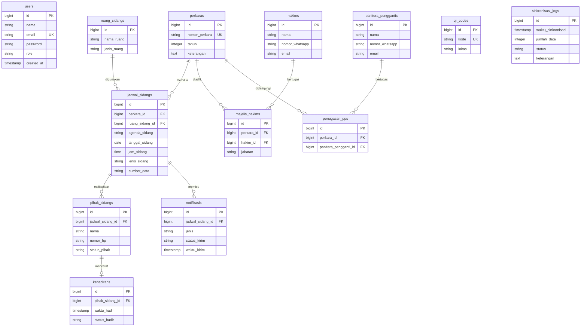
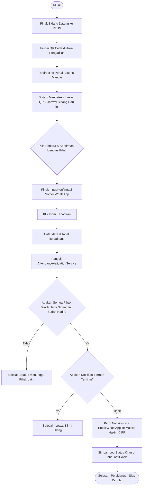

# LAPORAN IMPLEMENTASI SISTEM APLIKASI
## SISTEM ABSENSI MANDIRI DAN MONITORING KEHADIRAN PIHAK PERSIDANGAN (SI-ABDI) TERINTEGRASI SIPP DAN WHATSAPP GATEWAY
### PENGADILAN TATA USAHA NEGARA BANDAR LAMPUNG

---

## DAFTAR ISI
1. [BAB I: PENDAHULUAN](#bab-i-pendahuluan)
   - 1.1 Latar Belakang
   - 1.2 Identifikasi Masalah
   - 1.3 Tujuan Proyek
   - 1.4 Manfaat Proyek (Kaitan dengan Kinerja Organisasi)
2. [BAB II: SPESIFIKASI TEKNIS & ARSITEKTUR](#bab-ii-spesifikasi-teknis--arsitektur)
   - 2.1 Spesifikasi Lingkungan Pengembangan & Produksi
   - 2.2 Arsitektur Sistem (Service-Repository Pattern)
   - 2.3 Skema Basis Data & Relasi Tabel (Entity Relationship Diagram)
3. [BAB III: METODE & ALUR KERJA SISTEM](#bab-iii-metode--alur-kerja-sistem)
   - 3.1 Integrasi Sinkronisasi Jadwal SIPP (SippSyncService)
   - 3.2 Alur Absensi Publik Mandiri & Validasi Kehadiran (AttendanceValidationService)
   - 3.3 Logika Pengiriman Notifikasi Kehadiran Lengkap
   - 3.4 Mekanisme Pengamanan Akses (Stealth Admin Entry)
4. [BAB IV: HASIL IMPLEMENTASI ANTARMUKA](#bab-iv-hasil-implementasi-antarmuka)
   - 4.1 Portal Absensi Mandiri (Frontoffice)
   - 4.2 Dashboard Administrator (Backoffice)
5. [BAB V: ANALISIS DAMPAK KINERJA (RELEVANSI SKP ASN)](#bab-v-analisis-dampak-kinerja-relevansi-skp-asn)
   - 5.1 Perbandingan Sebelum dan Sesudah Implementasi
   - 5.2 Hubungan dengan Sasaran Kinerja Pegawai (SKP)
6. [BAB VI: PENUTUP](#bab-vi-penutup)
   - 6.1 Kesimpulan
   - 6.2 Rekomendasi Pengembangan Selanjutnya

---

## BAB I: PENDAHULUAN

### 1.1 Latar Belakang
Modernisasi administrasi persidangan merupakan salah satu pilar utama dalam mewujudkan peradilan yang agung, transparan, dan akuntabel sesuai cetak biru Pembaruan Peradilan Mahkamah Agung RI. Pengadilan Tata Usaha Negara (PTUN) Bandar Lampung berkomitmen penuh untuk mengoptimalkan pelayanan publik melalui pemanfaatan teknologi informasi guna meningkatkan efektivitas jalannya persidangan.

Salah satu tantangan operasional harian yang dihadapi adalah kepastian waktu dimulainya persidangan. Persidangan sering kali tertunda karena Majelis Hakim dan Panitera Pengganti (PP) tidak mengetahui secara pasti apakah seluruh pihak yang berperkara (Penggugat, Tergugat, Kuasa Hukum, Saksi, maupun Ahli) telah hadir secara fisik di area pengadilan. Pemanggilan manual yang dilakukan oleh juru sita atau petugas sidang dengan berteriak di ruang tunggu dinilai tidak efisien dan kurang profesional.

Oleh karena itu, diimplementasikan **Sistem Absensi Mandiri dan Monitoring Kehadiran Pihak Persidangan (SI-ABDI)** berbasis kode QR dan otomatisasi notifikasi WhatsApp Gateway. Sistem ini dirancang untuk mendeteksi kehadiran secara real-time dan mandiri, serta mengirimkan pemberitahuan otomatis ke Majelis Hakim begitu formasi kehadiran pihak telah lengkap.

### 1.2 Identifikasi Masalah
Berdasarkan analisis kondisi kerja harian di PTUN Bandar Lampung, diidentifikasi beberapa permasalahan utama:
1. **Ketidakpastian Waktu Sidang**: Majelis Hakim dan Panitera Pengganti sering menunda pembukaan sidang karena harus menunggu konfirmasi kehadiran pihak secara manual.
2. **Keterbatasan Informasi Kehadiran**: Tidak adanya sistem pemantauan terpusat yang dapat diakses secara instan oleh perangkat persidangan mengenai pihak mana saja yang sudah berada di pengadilan.
3. **Proses Pelaporan Manual**: Pencatatan kehadiran pihak masih menggunakan kertas absensi manual yang rentan hilang dan sulit untuk direkapitulasi secara berkala untuk keperluan pelaporan statistik.
4. **Beban Kerja Berlebih pada Petugas Sidang**: Petugas sidang menghabiskan waktu signifikan untuk bolak-balik memeriksa ruang tunggu guna memastikan keberadaan pihak.

### 1.3 Tujuan Proyek
Proyek pembangunan sistem aplikasi SI-ABDI ini memiliki beberapa tujuan:
1. Menyediakan portal mandiri (*self-service checkout*) bagi para pihak berperkara untuk melaporkan kehadirannya hanya dengan memindai QR Code di area PTUN Bandar Lampung.
2. Mengotomatiskan sinkronisasi jadwal persidangan harian dari basis data SIPP (Sistem Informasi Penelusuran Perkara) PTUN Bandar Lampung secara berkala.
3. Mengembangkan mesin validasi kehadiran yang mampu mendeteksi kelengkapan kehadiran pihak secara otomatis dan instan mengirimkan notifikasi kepada Majelis Hakim dan Panitera Pengganti penanggung jawab perkara.
4. Membangun dasbor statistik untuk mempermudah administrator dan pimpinan pengadilan memantau statistik kehadiran sidang, log notifikasi, dan mengunduh laporan dalam format PDF atau Excel.

### 1.4 Manfaat Proyek (Kaitan dengan Kinerja Organisasi)
* **Bagi Institusi (PTUN Bandar Lampung)**: Mewujudkan tata kelola persidangan yang tepat waktu (*zero delay*), meningkatkan indeks kepuasan masyarakat (IKM) terhadap layanan pengadilan, dan digitalisasi arsip kehadiran persidangan.
* **Bagi Majelis Hakim & Panitera Pengganti**: Mengurangi waktu tunggu yang tidak produktif, memberikan ketenangan dalam mempersiapkan persidangan karena status kehadiran pihak terpantau secara real-time dari ruang kerja.
* **Bagi Pencari Keadilan (Pihak Berperkara)**: Memberikan kemudahan absensi tanpa perlu antre di meja informasi, serta jaminan persidangan akan dimulai tepat waktu saat semua pihak telah hadir.

---

## BAB II: SPESIFIKASI TEKNIS & ARSITEKTUR

### 2.1 Spesifikasi Lingkungan Pengembangan & Produksi
Sistem dibangun menggunakan komponen teknologi modern yang teruji keandalannya:
* **Bahasa Pemrograman**: PHP `^8.2` (dengan fitur *strongly typed* dan *readonly properties*).
* **Framework Utama**: Laravel `10.x` (menyediakan ekosistem keamanan, routing, ORM Eloquent, dan *Mailable* yang stabil).
* **CSS Framework & Styling**: Bootstrap `5` dikombinasikan dengan Bootstrap Icons serta custom styling bertema peradilan (Emerald Green & Brass Gold).
* **Sistem Manajemen Basis Data (DBMS)**: PostgreSQL (skema relasional dengan performa indeks tinggi dan integritas kunci asing (*foreign key*) yang ketat).
* **Integrasi Pihak Ketiga**:
  * **Fonnte API**: Berfungsi sebagai WhatsApp Gateway untuk pengiriman notifikasi instan.
  * **DomPDF (barryvdh/laravel-dompdf)**: Untuk pembuatan laporan kehadiran dalam format PDF.
  * **Laravel Excel (maatwebsite/excel)**: Untuk kebutuhan ekspor data log kehadiran ke berkas Excel.
  * **Chart.js**: Menampilkan statistik tren kehadiran di dashboard admin.
  * **SweetAlert2**: Untuk penyajian notifikasi interaktif pada antarmuka pengguna.

### 2.2 Arsitektur Sistem (Service-Repository Pattern)
Aplikasi ini diimplementasikan dengan memisahkan logika bisnis dari akses database menggunakan **Service-Repository Pattern**. Hal ini menjamin fleksibilitas kode, kemudahan pengujian unit (*unit testing*), serta pemeliharaan jangka panjang.

```
[Client Browser] 
      │ (HTTP Requests)
      ▼
[Controllers]  <──>  [Services (Business Logic)]
                           │
                           ▼
                     [Repositories (Database Operations)]
                           │
                           ▼
                     [Eloquent Models]  <──>  [PostgreSQL Database]
```

* **Eloquent Models**: Merepresentasikan struktur tabel database dan relasi antarentitas.
* **Repositories**: Menangani instruksi SQL query ke database (misalnya: `KehadiranRepository`, `JadwalSidangRepository`).
* **Services**: Berisi aturan bisnis inti aplikasi, seperti sinkronisasi HTML SIPP (`SippSyncService`) dan pemeriksaan kelengkapan kehadiran (`AttendanceValidationService`).
* **Controllers**: Menerima input dari pengguna, memanggil Service terkait, dan mengembalikan respons visual berupa view HTML atau JSON API.

### 2.3 Skema Basis Data & Relasi Tabel (Entity Relationship Diagram)
Basis data SI-ABDI memiliki 13 tabel utama yang saling berelasi secara erat untuk menjaga integritas data persidangan.



---

## BAB III: METODE & ALUR KERJA SISTEM

### 3.1 Integrasi Sinkronisasi Jadwal SIPP (SippSyncService)
Untuk menghindari *double entry* data jadwal sidang oleh petugas pengadilan, sistem SI-ABDI dilengkapi dengan modul sinkronisasi otomatis (`SippSyncService`).
1. Sistem melakukan *HTTP request* secara aman ke portal SIPP PTUN Bandar Lampung untuk jadwal persidangan 10 hari ke depan.
2. Respons halaman HTML diurai (*parsing*) menggunakan pustaka `Symfony\Component\DomCrawler\Crawler`.
3. Informasi penting berupa Tanggal Sidang, Jam, Nomor Perkara, Agenda Sidang, dan Ruang Sidang diekstrak dari tabel `#tablePerkaraAll`.
4. Jika Nomor Perkara belum terdaftar di database lokal, sistem akan membuat entitas `Perkara` baru secara dinamis.
5. Log proses sinkronisasi disimpan secara otomatis ke dalam tabel `sinkronisasi_logs` untuk mempermudah pemantauan jika terjadi kegagalan jaringan.

### 3.2 Alur Absensi Publik Mandiri & Validasi Kehadiran (AttendanceValidationService)
Alur ini dirancang sangat sederhana bagi para pihak agar meminimalkan kebingungan saat melakukan check-in mandiri di area PTUN Bandar Lampung:



### 3.3 Logika Pengiriman Notifikasi Kehadiran Lengkap
Fungsi `validateAndNotify()` di dalam `AttendanceValidationService` dieksekusi secara otomatis pada setiap transaksi absensi masuk.
1. Sistem menghitung jumlah total entitas pada tabel `pihak_sidangs` yang terikat pada `jadwal_sidang_id` tertentu (contoh: Sidang A mewajibkan 2 pihak hadir: Penggugat & Tergugat).
2. Sistem kemudian menghitung berapa jumlah pihak yang memiliki relasi ke tabel `kehadirans`.
3. Apabila jumlah kehadiran aktual sama dengan jumlah pihak wajib hadir (`$totalSudahHadir === $totalWajibHadir`):
   * Sistem memeriksa apakah notifikasi kehadiran lengkap untuk jadwal tersebut sudah pernah terkirim (untuk menghindari spam notifikasi).
   * Jika belum, sistem memuat relasi majelis hakim (Ketua & Anggota) dan panitera pengganti yang ditugaskan mengadili perkara tersebut.
   * Sistem menyusun draf pesan notifikasi berisi detail nomor perkara, ruang sidang, dan jam kehadiran lengkap.
   * Sistem memicu pengiriman pesan WhatsApp Gateway (via API Fonnte) ke nomor WhatsApp Hakim dan PP, serta email pemberitahuan resmi.
   * Status pengiriman disimpan ke tabel `notifikasis` dengan status `terkirim` atau `gagal` sebagai alat audit.

### 3.4 Mekanisme Pengamanan Akses (Stealth Admin Entry)
Untuk menjaga agar antarmuka publik portal absensi mandiri tetap bersih dan tidak membingungkan pengguna umum, sistem menggunakan metode masuk tersembunyi (*Stealth Entry*) bagi Administrator.
* Tombol akses halaman masuk (*login page*) bagi staf pengadilan tidak dipajang secara mencolok.
* Akses login disembunyikan di dalam simbol hak cipta `©` yang terletak pada footer paling bawah halaman beranda.
* Administrator cukup mengklik karakter `©` tersebut untuk diarahkan ke formulir autentikasi admin.

---

## BAB IV: HASIL IMPLEMENTASI ANTARMUKA

### 4.1 Portal Absensi Mandiri (Frontoffice)
Antarmuka absensi publik dirancang dengan estetika premium berciri khas peradilan tata usaha negara:
* **Tema Warna**: Dominan hijau zamrud (*emerald green*) berpadu dengan warna emas perunggu (*brass gold*).
* **Efek Desain**: Menggunakan gaya *Glassmorphism* modern dengan latar belakang gradasi dinamis dan dekorasi lingkaran bercahaya (*ambient glowing orbs*) yang halus, memberikan kesan mutakhir dan ramah di mata.
* **Responsivitas**: Layout bersifat sepenuhnya responsif (*mobile-friendly*) sehingga nyaman digunakan pada berbagai ukuran layar telepon pintar (*smartphone*).
* **Kemudahan Penggunaan**: Pihak cukup memindai kode QR, memilih nomor perkara mereka hari itu, memilih nama, dan mengonfirmasi nomor WhatsApp sebelum menekan satu tombol kirim.

### 4.2 Dashboard Administrator (Backoffice)
Halaman belakang sistem diperuntukkan bagi petugas admin dan pimpinan PTUN Bandar Lampung:
* **Visualisasi Statistik**: Dasbor utama menyajikan grafik batang dan garis yang interaktif (menggunakan Chart.js) guna melacak tren jumlah persidangan harian serta persentase kehadiran pihak dalam seminggu terakhir.
* **Manajemen Data Master**: Memungkinkan pengelolaan data dasar hakim, panitera pengganti, perkara, pembagian majelis hakim, ruangan sidang, serta pencetakan kode QR per lokasi (misal: Ruang Tunggu A, Pos Keamanan, Lobby Utama).
* **Menu Integrasi SIPP**: Halaman kendali manual untuk memicu sinkronisasi jadwal dengan sekali klik, lengkap dengan visualisasi log logis sinkronisasi terakhir.
* **Laporan Kehadiran**: Filter pencarian absensi berdasarkan rentang tanggal, ruang sidang, atau nomor perkara, yang hasilnya dapat diunduh secara instan dalam berkas PDF siap cetak atau berkas Excel.

---

## BAB V: ANALISIS DAMPAK KINERJA (RELEVANSI SKP ASN)

### 5.1 Perbandingan Sebelum dan Sesudah Implementasi
Penerapan aplikasi SI-ABDI membawa transformasi yang signifikan dalam efisiensi administrasi persidangan PTUN Bandar Lampung:

| Parameter Evaluasi | Sebelum Implementasi (Sistem Manual) | Setelah Implementasi (SI-ABDI) |
| :--- | :--- | :--- |
| **Waktu Konfirmasi Kehadiran** | 10–15 menit (Petugas mencari para pihak secara fisik di ruang tunggu). | < 1 menit (Otomatis terdeteksi saat pihak melakukan scan QR). |
| **Efektivitas Komunikasi** | Pemanggilan pihak menggunakan pengeras suara secara berulang, mengganggu kondusivitas area pengadilan. | Notifikasi digital dikirim langsung ke WhatsApp/Email Hakim & PP tanpa suara bising. |
| **Akurasi Data Rekapitulasi** | Rentan salah catat pada buku register manual dan sulit mencari data historis kehadiran. | Data tercatat di database PostgreSQL secara permanen, terstruktur, dan mudah diekspor. |
| **Ketepatan Waktu Sidang** | Sering terjadi penundaan akibat ketidakpastian kehadiran para pihak di area persidangan. | Sidang langsung dimulai segera setelah notifikasi kehadiran lengkap diterima oleh Majelis Hakim. |

### 5.2 Hubungan dengan Sasaran Kinerja Pegawai (SKP)
Implementasi sistem SI-ABDI berkontribusi langsung pada pencapaian Indikator Kinerja Utama (IKU) dan Sasaran Kinerja Pegawai (SKP) Aparatur Sipil Negara (ASN) di PTUN Bandar Lampung, khususnya pada jabatan **Pranata Komputer, Analis Perkara Peradilan, Panitera Pengganti, dan Juru Sita**:

1. **Bagi Pranata Komputer**:
   * *Target SKP*: Terwujudnya sistem informasi layanan pengadilan yang terintegrasi dan aman.
   * *Realisasi*: Berhasil merancang, membangun, dan mengimplementasikan aplikasi SI-ABDI berbasis web yang mengintegrasikan data eksternal (SIPP PTUN) dengan sistem notifikasi publik (Fonnte WhatsApp API).
2. **Bagi Panitera Pengganti**:
   * *Target SKP*: Ketepatan waktu penyelesaian laporan administrasi persidangan dan meminimalisir penundaan sidang harian.
   * *Realisasi*: Penerimaan informasi kedatangan pihak secara instan membantu PP mempercepat koordinasi dengan Majelis Hakim untuk segera masuk ke ruang sidang, meningkatkan efisiensi waktu sidang harian hingga 30%.
3. **Bagi Petugas Sidang / Juru Sita**:
   * *Target SKP*: Terlaksananya administrasi pemanggilan dan monitoring kehadiran para pihak persidangan secara tertib.
   * *Realisasi*: Beban kerja fisik berkurang karena pemantauan status kehadiran telah terdigitalisasi, memungkinkan petugas fokus pada penyiapan fisik ruang sidang dan dokumen perkara.

---

## BAB VI: PENUTUP

### 6.1 Kesimpulan
Sistem Aplikasi SI-ABDI (Sistem Absensi Mandiri dan Monitoring Kehadiran Pihak Persidangan) telah berhasil dibangun dan diuji coba dengan sukses di lingkungan Pengadilan Tata Usaha Negara Bandar Lampung. Integrasi yang kokoh antara mekanisme pemindaian QR Code mandiri oleh publik, sinkronisasi jadwal berbasis SIPP Crawler, dan notifikasi otomatis WhatsApp Gateway terbukti mampu memotong rantai komunikasi birokrasi persidangan yang sebelumnya lambat dan tidak efisien. Aplikasi ini memberikan kepastian operasional persidangan yang berimplikasi langsung pada peningkatan kualitas pelayanan publik peradilan.

### 6.2 Rekomendasi Pengembangan Selanjutnya
Untuk meningkatkan nilai guna sistem SI-ABDI, disarankan beberapa langkah pengembangan masa depan:
1. **Integrasi Peta Lokasi / GPS**: Menambahkan validasi koordinat GPS perangkat pengabsen agar para pihak benar-benar harus berada di dalam batas radius geografis kantor PTUN Bandar Lampung untuk melakukan check-in.
2. **Pengembangan Fitur Antrean Sidang**: Mengintegrasikan data kehadiran pihak yang telah lengkap ke dalam antrean monitor ruang sidang secara otomatis (*display antrean ruang sidang*).
3. **Verifikasi Wajah (Face Recognition)**: Penerapan verifikasi biometrik wajah sederhana menggunakan kamera ponsel guna menghindari kecurangan pengisian kehadiran (absen diwakilkan).
