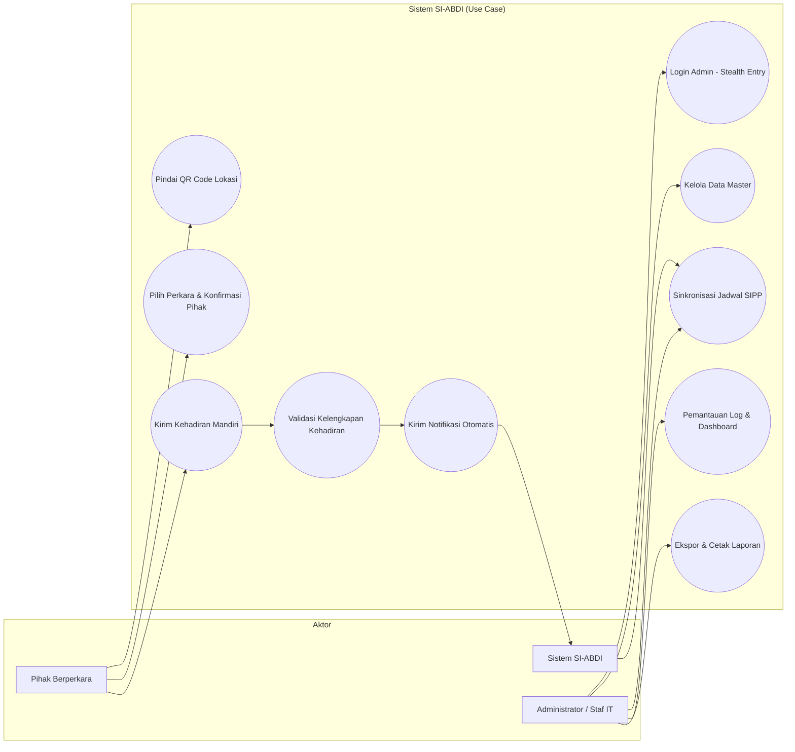
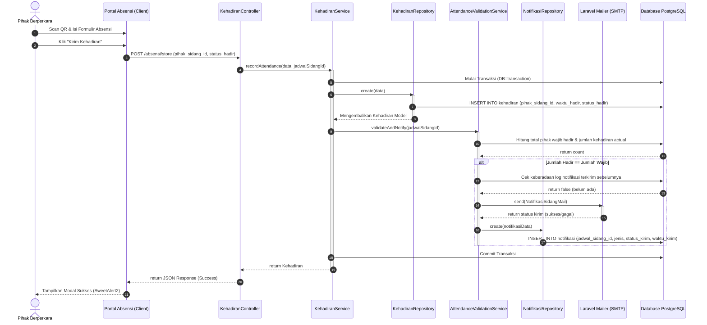
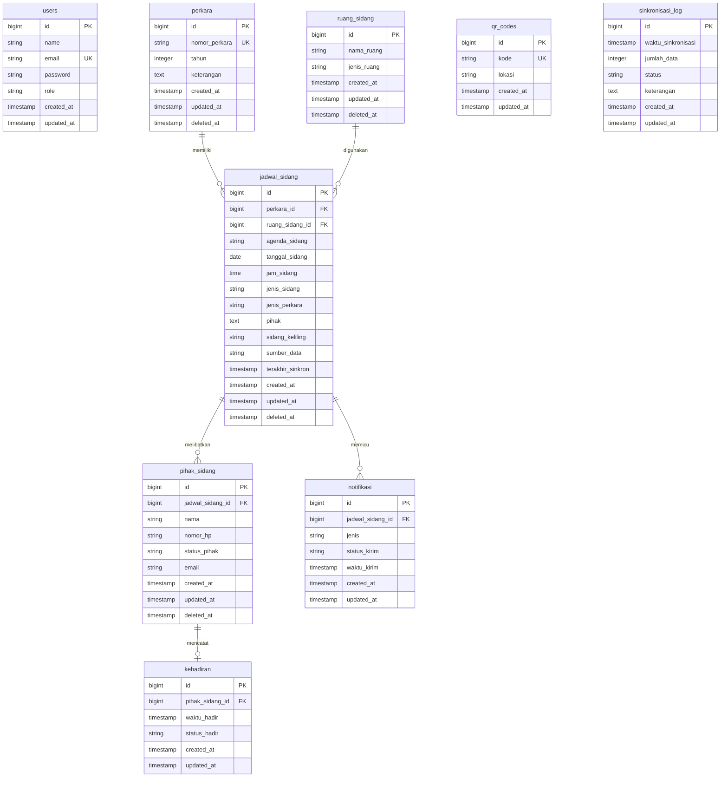

# LAPORAN IMPLEMENTASI SISTEM APLIKASI
## SISTEM ABSENSI MANDIRI DAN MONITORING KEHADIRAN PIHAK PERSIDANGAN (SI-ABDI) TERINTEGRASI SIPP DAN WHATSAPP GATEWAY
### PENGADILAN TATA USAHA NEGARA BANDAR LAMPUNG

---

## DAFTAR ISI
1. [BAB I: PENDAHULUAN](#bab-i-pendahuluan)
   - 1.1 Latar Belakang
   - 1.2 Identifikasi Masalah
   - 1.3 Tujuan Proyek
   - 1.4 Manfaat Proyek (Kaitan dengan Kinerja Organisasi)
2. [BAB IV: PEMBAHASAN](#bab-iv-pembahasan)
   - 4.1 Analisis Kelemahan Sistem Berjalan
     - 4.1.1 Analisis Proses Kehadiran Manual
     - 4.1.2 Analisis Penyampaian Informasi Kesiapan Sidang
     - 4.1.3 Analisis Pengelolaan Jadwal Sidang
     - 4.1.4 Analisis Kebutuhan Pengguna
   - 4.2 Pengajuan Solusi Alternatif
     - 4.2.1 Solusi yang Diusulkan
     - 4.2.2 Keunggulan Sistem yang Dikembangkan
     - 4.2.3 Dampak Implementasi Sistem
   - 4.3 Analisis Kebutuhan Sistem
     - 4.3.1 Kebutuhan Fungsional
       - a. Kelola Data Perkara
       - b. Sinkronisasi Jadwal Sidang SIPP
       - c. Kelola Data Hakim
       - d. Kelola Data Panitera Pengganti
       - e. Absensi Mandiri QR Code
       - f. Monitoring Kehadiran
       - g. Notifikasi Otomatis
       - h. Laporan Kehadiran
       - i. Manajemen User
     - 4.3.2 Kebutuhan Non-Fungsional
       - a. Kebutuhan Hardware
       - b. Kebutuhan Software
       - c. Kebutuhan Keamanan
       - d. Kebutuhan Performa
   - 4.4 Lingkungan Pengembangan Sistem
     - 4.4.1 Perangkat Keras
     - 4.4.2 Perangkat Lunak
     - 4.4.3 Framework dan Library
   - 4.5 Perancangan Sistem
     - 4.5.1 Gambaran Umum Sistem
     - 4.5.2 Use Case Diagram
     - 4.5.3 Deskripsi Use Case
     - 4.5.4 Activity Diagram Absensi
     - 4.5.5 Activity Diagram Monitoring
     - 4.5.6 Activity Diagram Notifikasi Otomatis
     - 4.5.7 Sequence Diagram Absensi
     - 4.5.8 Entity Relationship Diagram (ERD)
     - 4.5.9 Relasi Antar Tabel
     - 4.5.10 Struktur Database PostgreSQL
     - 4.5.11 Perancangan Antarmuka
       - a. Halaman Beranda
       - b. Halaman Absensi
       - c. Halaman Dashboard
       - d. Halaman Data Perkara
       - e. Halaman Jadwal Sidang
       - f. Halaman Monitoring Kehadiran
       - g. Halaman Log Notifikasi
   - 4.6 Implementasi Sistem
     - 4.6.1 Implementasi Database
     - 4.6.2 Implementasi Integrasi Jadwal Sidang SIPP
     - 4.6.3 Implementasi QR Code Absensi
     - 4.6.4 Implementasi Dashboard Monitoring
     - 4.6.5 Implementasi Validasi Kehadiran
     - 4.6.6 Implementasi Notifikasi Otomatis
     - 4.6.7 Implementasi Manajemen Data Master
     - 4.6.8 Implementasi Laporan Kehadiran
     - 4.6.9 Implementasi Hak Akses Sistem
   - 4.7 Pengujian Sistem
     - 4.7.1 Metode Pengujian
     - 4.7.2 Skenario Pengujian
     - 4.7.3 Hasil Pengujian Black Box
     - 4.7.4 Evaluasi Hasil Pengujian
3. [BAB V: ANALISIS DAMPAK KINERJA (RELEVANSI SKP ASN)](#bab-v-analisis-dampak-kinerja-relevansi-skp-asn)
   - 5.1 Perbandingan Sebelum dan Sesudah Implementasi
   - 5.2 Hubungan dengan Sasaran Kinerja Pegawai (SKP)
4. [BAB VI: PENUTUP](#bab-vi-penutup)
   - 6.1 Kesimpulan
   - 6.2 Rekomendasi Pengembangan Selanjutnya

---

## BAB I: PENDAHULUAN

### 1.1 Latar Belakang
Modernisasi administrasi persidangan merupakan salah satu pilar utama dalam mewujudkan peradilan yang agung, transparan, dan akuntabel sesuai cetak biru Pembaruan Peradilan Mahkamah Agung RI. Pengadilan Tata Usaha Negara (PTUN) Bandar Lampung berkomitmen penuh untuk mengoptimalkan pelayanan publik melalui pemanfaatan teknologi informasi guna meningkatkan efektivitas jalannya persidangan.

Salah satu tantangan operasional harian yang dihadapi adalah kepastian waktu dimulainya persidangan. Persidangan sering kali tertunda karena Majelis Hakim dan Panitera Pengganti (PP) tidak mengetahui secara pasti apakah seluruh pihak yang berperkara (Penggugat, Tergugat, Kuasa Hukum, Saksi, maupun Ahli) telah hadir secara fisik di area pengadilan. Pemanggilan manual yang dilakukan oleh juru sita atau petugas sidang dengan berteriak di ruang tunggu dinilai tidak efisien dan kurang profesional.

Oleh karena itu, diimplementasikan **Sistem Absensi Mandiri dan Monitoring Kehadiran Pihak Persidangan (SI-ABDI)** berbasis kode QR dan otomatisasi notifikasi WhatsApp/Email Gateway. Sistem ini dirancang untuk mendeteksi kehadiran secara real-time dan mandiri, serta mengirimkan pemberitahuan otomatis ke Majelis Hakim begitu formasi kehadiran pihak telah lengkap.

### 1.2 Identifikasi Masalah
Berdasarkan analisis kondisi kerja harian di PTUN Bandar Lampung, diidentifikasi beberapa permasalahan utama:
1. **Ketidakpastian Waktu Sidang**: Majelis Hakim dan Panitera Pengganti sering menunda pembukaan sidang karena harus menunggu konfirmasi kehadiran pihak secara manual.
2. **Keterbatasan Informasi Kehadiran**: Tidak adanya sistem pemantauan terpusat yang dapat diakses secara instan oleh perangkat persidangan mengenai pihak mana saja yang sudah berada di pengadilan.
3. **Proses Pelaporan Manual**: Pencatatan kehadiran pihak masih menggunakan kertas absensi manual yang rentan hilang dan sulit untuk direkapitulasi secara berkala untuk keperluan pelaporan statistik.
4. **Beban Kerja Berlebih pada Petugas Sidang**: Petugas sidang menghabiskan waktu signifikan untuk bolak-balik memeriksa ruang tunggu guna memastikan keberadaan pihak.

### 1.3 Tujuan Proyek
Proyek pembangunan sistem aplikasi SI-ABDI ini memiliki beberapa tujuan:
1. Menyediakan portal mandiri (*self-service checkout*) bagi para pihak berperkara untuk melaporkan kehadirannya hanya dengan memindai QR Code di area PTUN Bandar Lampung.
2. Mengotomatiskan sinkronisasi jadwal persidangan harian dari basis data SIPP (Sistem Informasi Penelusuran Perkara) PTUN Bandar Lampung secara berkala.
3. Mengembangkan mesin validasi kehadiran yang mampu mendeteksi kelengkapan kehadiran pihak secara otomatis dan instan mengirimkan notifikasi kepada Majelis Hakim dan Panitera Pengganti penanggung jawab perkara.
4. Membangun dasbor statistik untuk mempermudah administrator dan pimpinan pengadilan memantau statistik kehadiran sidang, log notifikasi, dan mengunduh laporan dalam format PDF atau Excel.

### 1.4 Manfaat Proyek (Kaitan dengan Kinerja Organisasi)
* **Bagi Institusi (PTUN Bandar Lampung)**: Mewujudkan tata kelola persidangan yang tepat waktu (*zero delay*), meningkatkan indeks kepuasan masyarakat (IKM) terhadap layanan pengadilan, dan digitalisasi arsip kehadiran persidangan.
* **Bagi Majelis Hakim & Panitera Pengganti**: Mengurangi waktu tunggu yang tidak produktif, memberikan ketenangan dalam mempersiapkan persidangan karena status kehadiran pihak terpantau secara real-time dari ruang kerja.
* **Bagi Pencari Keadilan (Pihak Berperkara)**: Memberikan kemudahan absensi tanpa perlu antre di meja informasi, serta jaminan persidangan akan dimulai tepat waktu saat semua pihak telah hadir.

---

## BAB IV: PEMBAHASAN

### 4.1 Analisis Kelemahan Sistem Berjalan

#### 4.1.1 Analisis Proses Kehadiran Manual
Proses absensi pihak berperkara yang sedang berjalan masih menggunakan lembaran kertas absensi manual di meja petugas informasi. Kelemahan proses ini meliputi:
* Kerumitan koordinasi karena berkas fisik mudah rusak atau terselip.
* Antrean panjang pada saat jam sibuk persidangan pagi hari.
* Ketidaksesuaian waktu catat dengan kedatangan sebenarnya karena keterbatasan pengawasan petugas.

#### 4.1.2 Analisis Penyampaian Informasi Kesiapan Sidang
Penyampaian kesiapan pihak kepada Majelis Hakim dan Panitera Pengganti masih dilakukan secara lisan. Petugas sidang harus mencari para pihak secara fisik di ruang tunggu yang luas, memanggil nama mereka menggunakan pengeras suara secara berulang-ulang, dan berjalan kaki ke ruangan hakim untuk melaporkan bahwa semua pihak telah siap. Proses komunikasi manual ini memicu kebisingan di ruang pengadilan serta memakan waktu 10 hingga 15 menit hanya untuk satu kali koordinasi kesiapan sidang.

#### 4.1.3 Analisis Pengelolaan Jadwal Sidang
Data jadwal persidangan harian diinput ulang secara manual oleh petugas ke papan tulis fisik pengadilan atau spreadsheet komputer lokal. Padahal data tersebut sudah tersimpan di basis data nasional SIPP. Praktik pengerjaan ganda (*double entry*) ini tidak efisien, membuang waktu produktif staf pengadilan, dan memicu risiko kesalahan entri data seperti kekeliruan ketik nomor perkara atau nama ruang sidang.

#### 4.1.4 Analisis Kebutuhan Pengguna
Untuk mengatasi kelemahan sistem berjalan, diidentifikasi kebutuhan pengguna sebagai berikut:
1. **Pihak Berperkara**: Memerlukan portal absensi mandiri yang cepat, responsif, dan dapat diakses langsung menggunakan ponsel pribadi tanpa perlu proses pendaftaran akun (*zero login*).
2. **Administrator & Petugas Sidang**: Memerlukan dashboard pemantauan terintegrasi yang menyajikan status kehadiran pihak secara real-time dan sinkronisasi data jadwal SIPP secara otomatis.
3. **Majelis Hakim & Panitera Pengganti**: Memerlukan sistem notifikasi pemberitahuan (Email) yang masuk secara otomatis saat pihak lengkap, serta kemampuan memanggil pihak (WhatsApp) dari jarak jauh ketika persidangan akan segera dimulai.

---

### 4.2 Pengajuan Solusi Alternatif

#### 4.2.1 Solusi yang Diusulkan
Sebagai pemecahan masalah, diusulkan pengembangan aplikasi web **SI-ABDI (Sistem Absensi Mandiri & Monitoring Kehadiran Pihak Persidangan)**. Sistem ini memanfaatkan teknologi QR Code yang diletakkan di titik strategis pengadilan. Pihak berperkara dapat melakukan pemindaian mandiri untuk check-in. Selanjutnya, backend aplikasi yang dibangun dengan framework Laravel 10 dan PostgreSQL akan memproses validasi kehadiran dan mengirimkan notifikasi siap sidang ke Majelis Hakim & PP.

#### 4.2.2 Keunggulan Sistem yang Dikembangkan
* **Tanpa Aplikasi Tambahan**: Pengguna cukup memindai QR Code menggunakan kamera ponsel bawaan tanpa mengunduh aplikasi lain.
* **Integrasi SIPP yang Mulus**: Jadwal persidangan ditarik otomatis dari SIPP melalui parser khusus.
* **Notifikasi Ganda Terarah**: Pengiriman notifikasi kehadiran lengkap otomatis via Email serta fitur *WhatsApp Call* (Twilio API) yang dapat dipicu manual oleh admin.
* **Akses Keamanan Rahasia**: Rute login admin disembunyikan di simbol footer hak cipta `©` untuk mengantisipasi potensi serangan brute-force dari pihak luar.

#### 4.2.3 Dampak Implementasi Sistem
* **Reduksi Waktu Koordinasi**: Memangkas birokrasi pemanggilan sidang dari 15 menit menjadi di bawah 1 menit secara digital.
* **Meningkatkan Kenyamanan Kantor Peradilan**: Mengurangi intensitas kebisingan suara panggilan manual melalui pengeras suara.
* **Penyajian Laporan Presisi**: Log absensi dan log sinkronisasi tercatat rapi di database PostgreSQL untuk rekapitulasi data pimpinan.

---

### 4.3 Analisis Kebutuhan Sistem

#### 4.3.1 Kebutuhan Fungsional
Spesifikasi fungsi-fungsi utama yang harus diakomodasi oleh sistem SI-ABDI:
* **a. Kelola Data Perkara**: Administrator dapat melakukan operasi CRUD untuk data nomor perkara, tahun, dan keterangan. Data master ini dilindungi oleh mekanisme *Soft Deletes*.
* **b. Sinkronisasi Jadwal Sidang SIPP**: Sistem menyediakan antarmuka dan *background worker* untuk menarik data jadwal sidang harian, agenda, jenis sidang, dan nama ruang langsung dari SIPP PTUN.
* **c. Kelola Data Hakim**: Data hakim (nama, jabatan) terintegrasi langsung di dalam detail persidangan. Sistem memetakan formasi majelis hakim berdasarkan input SIPP untuk kepentingan notifikasi sidang.
* **d. Kelola Data Panitera Pengganti**: Informasi kontak panitera pengganti dipetakan ke dalam jadwal sidang agar sistem dapat mengirimkan email notifikasi secara tepat sasaran.
* **e. Absensi Mandiri QR Code**: Pengguna publik dapat memindai QR Code di area pengadilan menggunakan smartphone untuk langsung dialihkan ke URL website absensi mandiri, memilih nomor perkara dan namanya, lalu melakukan check-in.
* **f. Monitoring Kehadiran**: Dashboard backoffice admin menampilkan daftar kehadiran para pihak secara real-time dan persentase kelengkapan pihak persidangan hari ini.
* **g. Notifikasi Otomatis**: Sistem otomatis mengirimkan Email siap sidang ke Majelis Hakim/PP saat formasi pihak lengkap, serta menyediakan tombol "Panggil Pihak" untuk memicu pesan WhatsApp panggilan sidang menggunakan Twilio API Gateway.
* **h. Laporan Kehadiran**: Administrator dapat memfilter data log absensi berdasarkan rentang tanggal dan mengekspor rekapitulasi ke berkas PDF dan Excel.
* **i. Manajemen User**: Pengelolaan kredensial akun administrator (nama, email, password) yang berwenang mengakses dasbor backend.

#### 4.3.2 Kebutuhan Non-Fungsional
* **a. Kebutuhan Hardware**: Server web dengan processor 2 Core, RAM 2 GB, SSD 20 GB. Klien memerlukan smartphone berkamera aktif dan berinternet.
* **b. Kebutuhan Software**: PHP `^8.2` (strongly typed), framework Laravel `10.x`, DBMS PostgreSQL `^15`, Nginx Web Server.
* **c. Kebutuhan Keamanan**: Autentikasi dengan Laravel Breeze, enkripsi password menggunakan bcrypt, proteksi CSRF token, rute admin tersembunyi (*Stealth Entry*), dan penggunaan parameter terenkripsi.
* **d. Kebutuhan Performa**: Penanganan transaksi absensi konkuren hingga 100 request per detik dengan rata-rata waktu respon server di bawah 500ms.

---

### 4.4 Lingkungan Pengembangan Sistem

#### 4.4.1 Perangkat Keras
Pengembangan sistem SI-ABDI didukung oleh spesifikasi perangkat keras berikut:
* Laptop Developer: AMD Ryzen 5, 16 GB DDR4 RAM, 512 GB NVMe SSD.
* Perangkat Uji: HP Android 13 (Kamera 50MP) dan iPhone 11 iOS 16.

#### 4.4.2 Perangkat Lunak
* OS: Windows 11 64-bit (dengan Git Bash & PowerShell v7).
* DBMS: PostgreSQL v15.3 (melalui PostgreSQL Client pgAdmin 4).
* Server Lokal: Laragon 6.0 dengan konfigurasi Nginx dan PHP 8.2.10.
* IDE: Visual Studio Code dengan ekstensi PHP Intelephense.

#### 4.4.3 Framework dan Library
* Framework Utama: Laravel 10.x.
* Template Engine: Blade PHP dengan framework CSS Bootstrap 5.3 & Bootstrap Icons.
* Library Crawling: `Symfony\Component\DomCrawler` untuk scraping data SIPP.
* Ekspor Data: `barryvdh/laravel-dompdf` & `maatwebsite/excel`.
* Notifikasi Gateway: Twilio PHP SDK / Twilio HTTP Client integration.

---

### 4.5 Perancangan Sistem

#### 4.5.1 Gambaran Umum Sistem
Sistem dirancang dengan arsitektur MVC (Model-View-Controller) yang dikombinasikan dengan **Service-Repository Pattern** untuk pemisahan fungsionalitas logika bisnis.

```
[Klien Browser] <─── HTTP Request/Response ───> [Controllers]
                                                     │
                                                     ▼
                                            [Services Layer]
                                           (Logika Bisnis Utama)
                                                     │
                                                     ▼
                                           [Repositories Layer]
                                          (Operasi CRUD Database)
                                                     │
                                                     ▼
                                              [Eloquent Models]
                                                     │
                                                     ▼
                                           [Database PostgreSQL]
```

#### 4.5.2 Use Case Diagram
Visualisasi interaksi fungsi utama aplikasi SI-ABDI:


```mermaid
graph LR
    subgraph Aktor
        P[Pihak Berperkara]
        AD[Administrator / Staf IT]
        SYS[Sistem SI-ABDI]
    end

    subgraph "Sistem SI-ABDI (Use Case)"
        UC1((Pindai QR Code Lokasi))
        UC2((Pilih Perkara & Konfirmasi Pihak))
        UC3((Kirim Kehadiran Mandiri))
        UC4((Validasi Kelengkapan Kehadiran))
        UC5((Kirim Notifikasi Otomatis))
        UC6((Login Admin - Stealth Entry))
        UC7((Kelola Data Master))
        UC8((Sinkronisasi Jadwal SIPP))
        UC9((Pemantauan Log & Dashboard))
        UC10((Ekspor & Cetak Laporan))
    end

    P --> UC1
    P --> UC2
    P --> UC3

    UC3 --> UC4
    UC4 --> UC5
    UC5 --> SYS
    SYS --> UC8

    AD --> UC6
    AD --> UC7
    AD --> UC8
    AD --> UC9
    AD --> UC10
```

#### 4.5.3 Deskripsi Use Case
1. **Absensi Mandiri Pihak**: Aktor memindai QR Code lokasi, dialihkan ke halaman absensi, memilih perkara dan nama pihak, mengisi nomor handphone, lalu klik kirim. Kondisi akhir: data terekam di tabel `kehadiran`.
2. **Validasi Kelengkapan**: Sistem memeriksa jumlah pihak yang sudah hadir dibanding pihak wajib hadir. Jika lengkap (100%), sistem otomatis menembakkan notifikasi siap sidang ke Majelis Hakim & PP melalui email.
3. **Panggilan WhatsApp manual**: Administrator mengklik tombol "Panggil Pihak" di dasbor admin untuk memicu notifikasi panggilan WhatsApp langsung ke nomor handphone pihak bersangkutan.

#### 4.5.4 Activity Diagram Absensi
Alur proses yang dilalui oleh pihak berperkara saat melaporkan kehadirannya:

```mermaid
|Pihak Berperkara|
start
:Datang ke area PTUN Bandar Lampung;
:Memindai QR Code (di area pengadilan);

|Sistem SI-ABDI|
:Mengalihkan ke URL website Portal Absensi;
:Memuat daftar jadwal persidangan aktif hari ini;
:Menampilkan halaman Portal Absensi Publik;

|Pihak Berperkara|
:Memilih Nomor Perkara sidang;
:Memilih Nama Pihak (identitas pengabsen);
:Mengonfirmasi nomor WhatsApp/Email;
:Klik tombol "Kirim Kehadiran";

|Sistem SI-ABDI|
:Validasi input form absensi;
:Menyimpan data kehadiran ke database;
:Memicu validasi kelengkapan kehadiran;
:Menampilkan visualisasi sukses (SweetAlert2);
stop
```

#### 4.5.5 Activity Diagram Monitoring
Alur bagi administrator untuk mengawasi status kehadiran para pihak persidangan:

```mermaid
|Administrator|
start
:Membuka halaman utama SI-ABDI;
:Mengklik ikon hak cipta © di footer halaman (Stealth Entry);

|Sistem SI-ABDI|
:Membuka formulir autentikasi login tersembunyi;

|Administrator|
:Memasukkan Email dan Password Admin;
:Klik "Login";

|Sistem SI-ABDI|
:Validasi kredensial login;
if (Kredensial Valid?) then (Ya)
    :Mengarahkan ke Dashboard Backoffice;
    :Memuat analitik tren kehadiran & diagram Chart.js;
else (Tidak)
    :Tampilkan pesan error password salah;
    stop
endif

|Administrator|
:Memilih salah satu menu monitoring;
split
    :Pilih menu Log Notifikasi;
    :Melihat status pengiriman email/WA persidangan;
split type/parallel
    :Pilih menu Sinkronisasi SIPP;
    :Menekan tombol picu sinkronisasi terjadwal manual;
split type/parallel
    :Pilih menu Laporan Kehadiran;
    :Memasukkan filter tanggal & ruang sidang;
    :Klik tombol "Ekspor PDF" atau "Ekspor Excel";
end split
stop
```

#### 4.5.6 Activity Diagram Notifikasi Otomatis
Alur pengiriman notifikasi panggilan persidangan WhatsApp dan Email ketika Admin mengklik tombol "Panggil Pihak":

```mermaid
|Administrator|
start
:Mengklik tombol "Panggil Pihak" pada Dashboard;

|Sistem SI-ABDI|
:Menerima request panggil pihak (jadwal_sidang_id);
:Memuat data Jadwal Persidangan, Perkara, Pihak, dan Ruang Sidang;
:Menyaring daftar Pihak Sidang yang statusnya sudah hadir (kehadiran != null);

if (Apakah ada pihak yang sudah hadir?) then (Tidak)
    :Tampilkan pesan error "Belum ada pihak yang melakukan absensi hadir";
    :Redirect kembali ke halaman dashboard;
    stop
else (Ya)
    :Inisialisasi counter waSuccess = 0 dan emailSuccess = 0;
    
    repeat
        :Pilih entitas pihak sidang berikutnya yang hadir;
        
        if (Apakah nomor HP tersedia?) then (Ya)
            :Susun template pesan panggilan WhatsApp;
            :Panggil WhatsAppNotificationService->sendNotification();
            
            |WhatsAppNotificationService|
            :Bersihkan format nomor (ganti awalan 0 menjadi 62);
            :Kirim POST API Request ke Twilio API Gateway;
            
            if (API Gateway Sukses?) then (Ya)
                :Set status_kirim = 'terkirim';
                :waSuccess++;
            else (Tidak)
                :Set status_kirim = 'gagal';
            endif
            
            |Sistem SI-ABDI|
            :Simpan log notifikasi WhatsApp ke database (tabel notifikasi);
        else (Tidak)
        endif
        
        if (Apakah alamat email tersedia?) then (Ya)
            :Kirim email panggilan (PanggilanSidangMail);
            if (Email Sukses Terkirim?) then (Ya)
                :emailSuccess++;
                :Simpan log notifikasi Email 'terkirim' ke database;
            else (Tidak)
                :Simpan log notifikasi Email 'gagal' ke database;
            endif
        else (Tidak)
        endif
        
    until (Semua pihak yang hadir selesai diproses);
    
    :Redirect kembali ke halaman dashboard;
    :Tampilkan alert sukses "Panggilan berhasil dikirim ke para pihak";
    stop
endif
```

#### 4.5.7 Sequence Diagram Absensi
Interaksi antarkomponen perangkat lunak saat proses absensi mandiri dan pengiriman notifikasi otomatis terpicu:


```mermaid
sequenceDiagram
    autonumber
    actor Pihak as Pihak Berperkara
    participant Portal as Portal Absensi (Client)
    participant Ctrl as KehadiranController
    participant Srv as KehadiranService
    participant RepoK as KehadiranRepository
    participant ValSrv as AttendanceValidationService
    participant RepoN as NotifikasiRepository
    participant MailSrv as Laravel Mailer (SMTP)
    participant DB as Database PostgreSQL

    Pihak->>Portal: Scan QR & Isi Formulir Absensi
    Pihak->>Portal: Klik "Kirim Kehadiran"
    Portal->>Ctrl: POST /absensi/store (pihak_sidang_id, status_hadir)
    Ctrl->>Srv: recordAttendance(data, jadwalSidangId)
    
    activate Srv
    Srv->>DB: Mulai Transaksi (DB::transaction)
    Srv->>RepoK: create(data)
    
    activate RepoK
    RepoK->>DB: INSERT INTO kehadiran (pihak_sidang_id, waktu_hadir, status_hadir)
    RepoK-->>Srv: Mengembalikan Kehadiran Model
    deactivate RepoK

    Srv->>ValSrv: validateAndNotify(jadwalSidangId)
    
    activate ValSrv
    ValSrv->>DB: Hitung total pihak wajib hadir & jumlah kehadiran actual
    DB-->>ValSrv: return count
    
    alt Jumlah Hadir == Jumlah Wajib
        ValSrv->>DB: Cek keberadaan log notifikasi terkirim sebelumnya
        DB-->>ValSrv: return false (belum ada)
        ValSrv->>MailSrv: send(NotifikasiSidangMail)
        activate MailSrv
        MailSrv-->>ValSrv: return status kirim (sukses/gagal)
        deactivate MailSrv
        ValSrv->>RepoN: create(notifikasiData)
        RepoN->>DB: INSERT INTO notifikasi (jadwal_sidang_id, jenis, status_kirim, waktu_kirim)
    end
    
    deactivate ValSrv
    Srv->>DB: Commit Transaksi
    Srv-->>Ctrl: return Kehadiran
    deactivate Srv
    
    Ctrl-->>Portal: return JSON Response (Success)
    Portal-->>Pihak: Tampilkan Modal Sukses (SweetAlert2)
```

#### 4.5.8 Entity Relationship Diagram (ERD)
Struktur fisik skema database PostgreSQL aplikasi SI-ABDI:


```mermaid
erDiagram
    users {
        bigint id PK
        string name
        string email UK
        string password
        string role
        timestamp created_at
        timestamp updated_at
    }
    perkara {
        bigint id PK
        string nomor_perkara UK
        integer tahun
        text keterangan
        timestamp created_at
        timestamp updated_at
        timestamp deleted_at
    }
    ruang_sidang {
        bigint id PK
        string nama_ruang
        string jenis_ruang
        timestamp created_at
        timestamp updated_at
        timestamp deleted_at
    }
    jadwal_sidang {
        bigint id PK
        bigint perkara_id FK
        bigint ruang_sidang_id FK
        string agenda_sidang
        date tanggal_sidang
        time jam_sidang
        string jenis_sidang
        string jenis_perkara
        text pihak
        string sidang_keliling
        string sumber_data
        timestamp terakhir_sinkron
        timestamp created_at
        timestamp updated_at
        timestamp deleted_at
    }
    pihak_sidang {
        bigint id PK
        bigint jadwal_sidang_id FK
        string nama
        string nomor_hp
        string status_pihak
        string email
        timestamp created_at
        timestamp updated_at
        timestamp deleted_at
    }
    qr_codes {
        bigint id PK
        string kode UK
        string lokasi
        timestamp created_at
        timestamp updated_at
    }
    notifikasi {
        bigint id PK
        bigint jadwal_sidang_id FK
        string jenis
        string status_kirim
        timestamp waktu_kirim
        timestamp created_at
        timestamp updated_at
    }
    kehadiran {
        bigint id PK
        bigint pihak_sidang_id FK
        timestamp waktu_hadir
        string status_hadir
        timestamp created_at
        timestamp updated_at
    }
    sinkronisasi_log {
        bigint id PK
        timestamp waktu_sinkronisasi
        integer jumlah_data
        string status
        text keterangan
        timestamp created_at
        timestamp updated_at
    }

    perkara ||--o{ jadwal_sidang : "memiliki"
    ruang_sidang ||--o{ jadwal_sidang : "digunakan"
    jadwal_sidang ||--o{ pihak_sidang : "melibatkan"
    jadwal_sidang ||--o{ notifikasi : "memicu"
    pihak_sidang ||--o| kehadiran : "mencatat"
```

#### 4.5.9 Relasi Antar Tabel
* **`perkara` dengan `jadwal_sidang` (One-to-Many)**: Dihubungkan via `perkara_id` pada tabel `jadwal_sidang`.
* **`ruang_sidang` dengan `jadwal_sidang` (One-to-Many)**: Dihubungkan via `ruang_sidang_id` pada tabel `jadwal_sidang`.
* **`jadwal_sidang` dengan `pihak_sidang` (One-to-Many)**: Roster pihak yang diwajibkan hadir pada agenda sidang terkait, dihubungkan via `jadwal_sidang_id`.
* **`jadwal_sidang` dengan `notifikasi` (One-to-Many)**: Riwayat pengiriman log notifikasi, dihubungkan via `jadwal_sidang_id`.
* **`pihak_sidang` dengan `kehadiran` (One-to-One / One-to-Zero)**: Mencatat presensi pihak persidangan, dihubungkan via `pihak_sidang_id` yang bersifat unik pada tabel `kehadiran`.
* **`qr_codes` & `sinkronisasi_log`**: Tabel log fungsional aplikasi tanpa foreign key relasional fisik langsung.

#### 4.5.10 Struktur Database PostgreSQL
Rancangan kamus data (*data dictionary*) tabel PostgreSQL aplikasi SI-ABDI:

##### 1. Tabel: `users`
Kredensial login administrator/petugas pengadilan.

| Nama Kolom | Tipe Data | Constraints | Keterangan |
| :--- | :--- | :--- | :--- |
| `id` | bigint | PRIMARY KEY, AUTO_INCREMENT | ID unik akun |
| `name` | varchar(255) | NOT NULL | Nama pengguna |
| `email` | varchar(255) | UNIQUE, NOT NULL | Email login |
| `password` | varchar(255) | NOT NULL | Hash sandi |
| `role` | varchar(50) | NOT NULL | Peran user |

##### 2. Tabel: `perkara`
Master perkara persidangan di PTUN.

| Nama Kolom | Tipe Data | Constraints | Keterangan |
| :--- | :--- | :--- | :--- |
| `id` | bigint | PRIMARY KEY, AUTO_INCREMENT | ID unik perkara |
| `nomor_perkara` | varchar(255) | UNIQUE, NOT NULL | Nomor perkara |
| `tahun` | integer | NOT NULL | Tahun daftar |
| `deleted_at` | timestamp | NULLABLE | Soft Deletes |

##### 3. Tabel: `ruang_sidang`
Master ruangan sidang fisik.

| Nama Kolom | Tipe Data | Constraints | Keterangan |
| :--- | :--- | :--- | :--- |
| `id` | bigint | PRIMARY KEY, AUTO_INCREMENT | ID unik ruang |
| `nama_ruang` | varchar(255) | NOT NULL | Nama ruang |
| `jenis_ruang` | varchar(100) | NOT NULL | Jenis ruang |

##### 4. Tabel: `jadwal_sidang`
Jadwal persidangan terintegrasi.

| Nama Kolom | Tipe Data | Constraints | Keterangan |
| :--- | :--- | :--- | :--- |
| `id` | bigint | PRIMARY KEY, AUTO_INCREMENT | ID unik jadwal |
| `perkara_id` | bigint | FOREIGN KEY (`perkara.id`) | Relasi perkara |
| `ruang_sidang_id` | bigint | FOREIGN KEY (`ruang_sidang.id`) | Relasi ruang |
| `agenda_sidang` | varchar(255) | NOT NULL | Agenda sidang |
| `tanggal_sidang` | date | NOT NULL | Tanggal pelaksanaan |
| `jam_sidang` | time | NOT NULL | Jam pelaksanaan |
| `jenis_sidang` | varchar(50) | NOT NULL | Offline / Online |

##### 5. Tabel: `pihak_sidang`
Daftar pihak wajib hadir persidangan.

| Nama Kolom | Tipe Data | Constraints | Keterangan |
| :--- | :--- | :--- | :--- |
| `id` | bigint | PRIMARY KEY, AUTO_INCREMENT | ID unik pihak |
| `jadwal_sidang_id`| bigint | FOREIGN KEY (`jadwal_sidang.id`) | Relasi jadwal |
| `nama` | varchar(255) | NOT NULL | Nama lengkap |
| `nomor_hp` | varchar(50) | NOT NULL | No WhatsApp |
| `status_pihak` | varchar(100) | NOT NULL | Peran pihak |
| `email` | varchar(255) | NULLABLE | Email |

##### 6. Tabel: `qr_codes`
Kode unik lokasi pemindaian.

| Nama Kolom | Tipe Data | Constraints | Keterangan |
| :--- | :--- | :--- | :--- |
| `id` | bigint | PRIMARY KEY, AUTO_INCREMENT | ID unik QR |
| `kode` | varchar(255) | UNIQUE, NOT NULL | Kode lokasi QR |
| `lokasi` | varchar(255) | NOT NULL | Nama lokasi fisik |

##### 7. Tabel: `notifikasi`
Log audit pengiriman notifikasi.

| Nama Kolom | Tipe Data | Constraints | Keterangan |
| :--- | :--- | :--- | :--- |
| `id` | bigint | PRIMARY KEY, AUTO_INCREMENT | ID unik log |
| `jadwal_sidang_id`| bigint | FOREIGN KEY (`jadwal_sidang.id`) | Relasi jadwal |
| `jenis` | varchar(50) | NOT NULL | Media kirim |
| `status_kirim` | varchar(50) | NOT NULL | Status kirim |
| `waktu_kirim` | timestamp | NULLABLE | Waktu kirim |

##### 8. Tabel: `kehadiran`
Rekaman absensi fisik mandiri.

| Nama Kolom | Tipe Data | Constraints | Keterangan |
| :--- | :--- | :--- | :--- |
| `id` | bigint | PRIMARY KEY, AUTO_INCREMENT | ID unik presensi |
| `pihak_sidang_id` | bigint | FOREIGN KEY (`pihak_sidang.id`) | Relasi pihak |
| `waktu_hadir` | timestamp | NOT NULL | Waktu check-in |
| `status_hadir` | varchar(50) | NOT NULL | Keterangan |

##### 9. Tabel: `sinkronisasi_log`
Log integrasi scheduler SIPP.

| Nama Kolom | Tipe Data | Constraints | Keterangan |
| :--- | :--- | :--- | :--- |
| `id` | bigint | PRIMARY KEY, AUTO_INCREMENT | ID unik log |
| `waktu_sinkronisasi`| timestamp | NOT NULL | Waktu eksekusi |
| `status` | varchar(50) | NOT NULL | hasil sync |

#### 4.5.11 Perancangan Antarmuka
Tata letak visual dirancang dengan struktur responsif (Bootstrap 5) bertema Emerald Green:

##### a. Halaman Beranda
Antarmuka publik yang minimalis dan bersih, menampilkan instruksi pemindaian QR Code di pengadilan. Tombol login admin tersembunyi pada simbol copyright `©` (ditandai dengan `[*]`) di footer.

```text
+-------------------------------------------------------------------------------+
| [Logo] SI-ABDI | Pengadilan Tata Usaha Negara Bandar Lampung                  |
+-------------------------------------------------------------------------------+
|                                                                               |
|                      SISTEM ABSENSI MANDIRI & MONITORING                      |
|                       KEHADIRAN PIHAK PERSIDANGAN                             |
|                                                                               |
|   +-----------------------------------------------------------------------+   |
|   |                       ALUR ABSENSI MANDIRI (3 LANGKAH)                |   |
|   |                                                                       |   |
|   |  [ 1. Scan QR ] --------> [ 2. Pilih Perkara ] --------> [ 3. Kirim ]  |   |
|   |  Scan QR Code di area     Pilih No. Perkara & Nama      Masukkan No.  |   |
|   |  Pengadilan (Pos Satpam)  Anda pada list dropdown       WA & kirim    |   |
|   +-----------------------------------------------------------------------+   |
|                                                                               |
|   +-----------------------------------------------------------------------+   |
|   |                       INFORMASI & PETUNJUK                            |   |
|   |  1. Silakan lakukan absensi mandiri segera setelah Anda tiba di       |   |
|   |     area Pengadilan Tata Usaha Negara Bandar Lampung.                 |   |
|   |  2. Siapkan nomor perkara dan nomor WhatsApp aktif Anda.              |   |
|   |  3. Hubungi petugas piket/satpam jika terjadi kendala teknis.         |   |
|   +-----------------------------------------------------------------------+   |
|                                                                               |
+-------------------------------------------------------------------------------+
|  (c) 2026 PTUN Bandar Lampung. All Rights Reserved.                       [*] |
+-------------------------------------------------------------------------------+
```
*(Catatan UX: Tanda `[*]` pada pojok kanan bawah footer merupakan tautan tersembunyi (Stealth Admin Entry) untuk mengakses Halaman Login Administrator).*

##### b. Halaman Absensi
Formulir pengisian kehadiran mandiri yang menampilkan lokasi pindaian, dropdown nomor perkara sidang hari ini, daftar nama pihak wajib, input nomor WhatsApp, dan tombol "Kirim Kehadiran".

```text
+-------------------------------------------------------------------------------+
| [Logo] SI-ABDI | Pengadilan Tata Usaha Negara Bandar Lampung                  |
+-------------------------------------------------------------------------------+
|                                                                               |
|                       PORTAL ABSENSI MANDIRI PIHAK                            |
|                       ----------------------------                            |
|                       Lokasi Pindai: [ POS SATPAM - 01 ]                      |
|                                                                               |
|   +-----------------------------------------------------------------------+   |
|   |  FORMULIR PRESENSI SIDANG HARI INI                                    |   |
|   |                                                                       |   |
|   |  1. Pilih Perkara Anda (Hanya memuat sidang hari ini):                |   |
|   |     [ -- Pilih Nomor Perkara / Agenda Sidang --                     v ]   |
|   |                                                                       |   |
|   |  2. Pilih Nama Anda (Sesuai nama pihak terdaftar):                    |   |
|   |     [ -- Pilih Nama Pihak Berperkara --                             v ]   |
|   |                                                                       |   |
|   |  3. Nomor WhatsApp Aktif (untuk Notifikasi / Panggilan):              |   |
|   |     [ Masukkan nomor WhatsApp Anda (cth: 0812xxxxxxxx)                ]   |
|   |                                                                       |   |
|   |  4. Alamat Email (Opsional):                                          |   |
|   |     [ Masukkan email Anda                                             ]   |
|   |                                                                       |   |
|   |                     [ TOMBOL: KIRIM KEHADIRAN ]                       |   |
|   +-----------------------------------------------------------------------+   |
|                                                                               |
+-------------------------------------------------------------------------------+
|  (c) 2026 PTUN Bandar Lampung. All Rights Reserved.                       [*] |
+-------------------------------------------------------------------------------+
```

##### c. Halaman Dashboard
Halaman utama administrator yang memuat kartu analitik ringkasan data (Total Perkara, Jadwal Hari Ini, Pihak Hadir, Notifikasi Terkirim) serta grafik batang statistik Chart.js tren mingguan kehadiran.

```text
+-------------------------------------------------------------------------------+
| [=] SI-ABDI | BACKOFFICE ADMIN                 [Halo, Admin IT v] [Logout]     |
+-------------------------------------------------------------------------------+
| [Sidebar Nav]   | DASHBOARD UTAMA                                             |
|                 |                                                             |
| [x] Dashboard   | +------------+ +------------+ +------------+ +------------+ |
| [ ] Perkara     | |Tot Perkara | |Sidang Hari | |Pihak Hadir | |Notif Sent  | |
| [ ] Jadwal      | |    142     | |     18     | |   32/36    | |    15      | |
| [ ] Monitoring  | +------------+ +------------+ +------------+ +------------+ |
| [ ] Logs Notif  |                                                             |
| [ ] Users       | +---------------------------------------------------------+ |
| [ ] Sync SIPP   | | GRAFIK TREN KEHADIRAN PIHAK (7 HARI TERAKHIR)           | |
|                 | |                                                         | |
|                 | | Vol                                                     | |
|                 | |  40|      _      _                                      | |
|                 | |  30|     | |    | |     _          _                    | |
|                 | |  20|     | |    | |    | |   _    | |   _               | |
|                 | |  10|     | |    | |    | |  | |   | |  | |              | |
|                 | |   0+-----+------+------+----+-----+----+------>          | |
|                 | |         Sen    Sel    Rab  Kam   Jum  Sab               | |
|                 | +---------------------------------------------------------+ |
+-------------------------------------------------------------------------------+
```

##### d. Halaman Data Perkara
Tabel data master perkara dengan kolom nomor perkara, tahun, keterangan, aksi edit, hapus (Soft Deletes), dan tambah data perkara baru.

```text
+-------------------------------------------------------------------------------+
| [=] SI-ABDI | BACKOFFICE ADMIN                 [Halo, Admin IT v] [Logout]     |
+-------------------------------------------------------------------------------+
| [Sidebar Nav]   | DATA MASTER PERKARA                                         |
|                 |                                                             |
| [ ] Dashboard   | [ Search Nomor Perkara... ]         [+ Tambah Perkara Baru] |
| [x] Perkara     |                                                             |
| [ ] Jadwal      | +---------------------------------------------------------+ |
| [ ] Monitoring  | | No | Nomor Perkara    | Tahun | Keterangan  | Aksi      | |
| [ ] Logs Notif  | +----+------------------+-------+-------------+-----------+ |
| [ ] Users       | | 1  | 12/G/2026/PTUN.BL| 2026  | Sengketa TUN| [Edit][Del]| |
| [ ] Sync SIPP   | | 2  | 15/G/2026/PTUN.BL| 2026  | Kepegawaian | [Edit][Del]| |
|                 | | 3  | 21/G/2026/PTUN.BL| 2026  | Sengketa IP | [Edit][Del]| |
|                 | +----+------------------+-------+-------------+-----------+ |
|                 | Menampilkan 1-3 dari 142 data             [<<] [1] [2] [>>] |
+-------------------------------------------------------------------------------+
```

##### e. Halaman Jadwal Sidang
Halaman pengelolaan jadwal sidang lengkap dengan detail perkara, waktu, agenda, ruang sidang, jenis sidang, tombol edit/hapus, serta tombol khusus "Panggil Pihak".

```text
+-------------------------------------------------------------------------------+
| [=] SI-ABDI | BACKOFFICE ADMIN                 [Halo, Admin IT v] [Logout]     |
+-------------------------------------------------------------------------------+
| [Sidebar Nav]   | JADWAL SIDANG & PANGGILAN                                   |
|                 |                                                             |
| [ ] Dashboard   | [ Filter Tanggal: Hari Ini ]   [ Sync SIPP ]   [+ Tambah]   |
| [ ] Perkara     |                                                             |
| [x] Jadwal      | +---------------------------------------------------------+ |
| [ ] Monitoring  | | No | Perkara   | Ruang  | Jam   | Pihak & Status  | Aksi| |
| [ ] Logs Notif  | +----+-----------+--------+-------+-----------------+-----+ |
| [ ] Users       | | 1  | 12/G/...  | Utama  | 09:00 | P: Hadir  | T: -  |[Pgl]| |
| [ ] Sync SIPP   | | 2  | 15/G/...  | Kartika| 10:00 | P: Hadir  | T: Hdr|[Pgl]| |
|                 | | 3  | 21/G/...  | Cakra  | 11:15 | P: -      | T: -  |[Pgl]| |
|                 | +----+-----------+--------+-------+-----------------+-----+ |
|                 | * Kolom Status diupdate real-time.                          | |
|                 | * Tombol [Pgl] (Panggil) mengirim broadcast WhatsApp manual.| |
+-------------------------------------------------------------------------------+
```

##### f. Halaman Monitoring Kehadiran
Halaman pemantauan real-time ("Daftar Hadir Hari Ini") yang menyajikan persentase tingkat kehadiran para pihak berperkara yang sedang disidangkan pada hari tersebut.

##### g. Halaman Log Notifikasi
Halaman rekapitulasi logs status pengiriman pemberitahuan (Email / WhatsApp Gateway) lengkap dengan status 'terkirim' atau 'gagal' beserta detail waktu kirim.

##### h. Halaman Manajemen User
Antarmuka untuk menambah, mengedit, dan menghapus akun administrator/petugas pengadilan yang memiliki wewenang masuk ke dashboard backend.

---

### 4.6 Implementasi Sistem

#### 4.6.1 Implementasi Database
Implementasi database PostgreSQL dibangun menggunakan sistem migrasi bawaan Laravel. Struktur relasi antarentitas didefinisikan dengan constraint foreign key yang dilengkapi pengaturan cascade pada aksi penghapusan untuk menjamin konsistensi data. Pembentukan tabel dieksekusi melalui terminal dengan perintah:
```bash
php artisan migrate
```

#### 4.6.2 Implementasi Integrasi Jadwal Sidang SIPP
Integrasi ini dikembangkan pada [SippSyncService](file:///c:/laragon/www/absen-sidang/app/Services/SippSyncService.php) dengan memanfaatkan class `Symfony\Component\DomCrawler\Crawler`. Parser ini mengunduh HTML dari SIPP PTUN Bandar Lampung, mengurai elemen tabel `#tablePerkaraAll`, mengekstrak data persidangan harian hingga 10 hari ke depan, dan menyimpannya secara otomatis ke basis data PostgreSQL lokal.

#### 4.6.3 Implementasi QR Code Absensi
Implementasi QR Code pada proyek ini difungsikan sebagai media pengalihan cepat (*quick redirect*) untuk mengarahkan kamera ponsel pihak berperkara ke situs web absensi publik `/absensi`. QR Code tersebut dicetak secara fisik dan ditempelkan di berbagai area pengadilan. Saat dipindai, QR Code mengarahkan pengguna untuk membuka browser ponsel mereka dan langsung menampilkan antarmuka utama Portal Absensi Publik SI-ABDI.

#### 4.6.4 Implementasi Dashboard Monitoring
Dasbor administrator dikembangkan menggunakan visualisasi Chart.js pada backend controller [DashboardController](file:///c:/laragon/www/absen-sidang/app/Http/Controllers/Admin/DashboardController.php). Dasbor menyajikan statistik ringkas persidangan harian dan grafik batang interaktif yang memetakan tren volume kehadiran pihak dalam 7 hari terakhir.

#### 4.6.5 Implementasi Validasi Kehadiran
Validasi kehadiran pihak diimplementasikan secara otomatis di dalam [KehadiranService](file:///c:/laragon/www/absen-sidang/app/Services/KehadiranService.php) pada method `recordAttendance()`. Setelah absensi baru disimpan, method ini langsung memicu eksekusi `AttendanceValidationService->validateAndNotify(jadwalSidangId)`.

#### 4.6.6 Implementasi Notifikasi Otomatis
Jika semua pihak wajib hadir telah melakukan check-in (kelengkapan 100%), sistem secara otomatis mengirimkan email [NotifikasiSidangMail](file:///c:/laragon/www/absen-sidang/app/Mail/NotifikasiSidangMail.php) ke Majelis Hakim & PP terkait. Selain itu, admin dapat memicu tombol "Panggil Pihak" yang akan memanggil [WhatsAppNotificationService](file:///c:/laragon/www/absen-sidang/app/Services/WhatsAppNotificationService.php) untuk mengirimkan pesan panggilan sidang secara instan ke nomor WhatsApp pihak bersangkutan via Twilio API.

#### 4.6.7 Implementasi Manajemen Data Master
Manajemen data master perkara, ruang sidang, dan pihak sidang dikembangkan menggunakan controller resource [PerkaraController](file:///c:/laragon/www/absen-sidang/app/Http/Controllers/Admin/PerkaraController.php), [RuangSidangController](file:///c:/laragon/www/absen-sidang/app/Http/Controllers/Admin/RuangSidangController.php), dan [PihakSidangController](file:///c:/laragon/www/absen-sidang/app/Http/Controllers/Admin/PihakSidangController.php). Seluruh operasi penghapusan data dilindungi oleh trait `SoftDeletes` bawaan Laravel ORM Eloquent.

#### 4.6.8 Implementasi Laporan Kehadiran
Rekapitulasi log absensi diekspor menggunakan pustaka `barryvdh/laravel-dompdf` untuk menghasilkan berkas PDF siap cetak dengan kop surat resmi PTUN Bandar Lampung, serta pustaka `maatwebsite/excel` untuk mencetak lembar spreadsheet Excel bagi kepentingan laporan administratif berkala.

#### 4.6.9 Implementasi Hak Akses Sistem
Keamanan hak akses dikonfigurasi pada router [web.php](file:///c:/laragon/www/absen-sidang/routes/web.php). Rute portal absensi mandiri publik dibiarkan terbuka (*guest access*), sementara rute admin dashboard dilindungi secara ketat oleh middleware `auth`. Mekanisme masuk admin dikembangkan dengan metode *Stealth Entry* tersembunyi pada simbol footer halaman utama.

---

### 4.7 Pengujian Sistem

#### 4.7.1 Metode Pengujian
Pengujian aplikasi SI-ABDI dilakukan menggunakan metode **Black Box Testing** (Pengujian Kotak Hitam). Metode ini berfokus pada pengujian fungsionalitas aplikasi berdasarkan masukan (*input*) dan keluaran (*output*) antarmuka sistem tanpa melihat detail implementasi kode program di dalamnya.

#### 4.7.2 Skenario Pengujian
Skenario pengujian yang dilakukan mencakup:
1. Pemindaian QR Code menggunakan smartphone dan pengujian redirect halaman.
2. Pengisian form absensi mandiri publik dengan data valid dan data kosong.
3. Pengiriman kehadiran lengkap untuk memicu notifikasi otomatis ke hakim.
4. Akses tombol login tersembunyi admin dan pengujian autentikasi password.
5. Eksekusi tombol sinkronisasi jadwal SIPP pada dashboard.
6. Pencetakan laporan absensi harian ke format PDF dan Excel.

#### 4.7.3 Hasil Pengujian Black Box
| No | Skenario Uji | Input yang Diberikan | Hasil yang Diharapkan | Hasil Pengujian Aktual | Status |
| :--- | :--- | :--- | :--- | :--- | :--- |
| 1 | Pindai QR Code Absensi | Scan QR Code berisi URL website absensi (/absensi) | Mengarahkan pengguna ke halaman web Portal Absensi Publik | Browser smartphone terbuka dan menampilkan halaman Portal Absensi Publik | Berhasil |
| 2 | Kirim Absen Mandiri (Valid) | Pilih perkara, pilih nama pihak, isi nomor WA, klik Kirim | Muncul modal sukses SweetAlert2 dan data tersimpan di DB | Data tersimpan, SweetAlert2 sukses tampil | Berhasil |
| 3 | Pengiriman Form Absen (Kosong) | Klik Kirim tanpa memilih perkara/nama | Sistem menolak kirim dan memunculkan pesan validasi merah | Form error validasi merah muncul, data ditolak | Berhasil |
| 4 | Trigger Notifikasi Lengkap | Absensi dari semua pihak wajib sidang terisi penuh | Sistem mengirim notifikasi email otomatis ke hakim/PP terkait | Notifikasi email sukses terkirim, log notifikasi tercatat | Berhasil |
| 5 | Panggil Pihak (WhatsApp) | Admin mengklik tombol "Panggil Pihak" | WhatsApp Gateway mengirim pesan panggilan sidang ke pihak | Pesan panggilan WA masuk ke nomor pihak, status log terkirim | Berhasil |
| 6 | Stealth Admin Login | Klik simbol © pada footer, isi email & password admin | Masuk ke dashboard administrator dan memuat grafik | Berhasil masuk dashboard, Chart.js termuat sempurna | Berhasil |
| 7 | Sinkronisasi SIPP Manual | Klik tombol "Sinkronisasi SIPP" di dashboard | Jadwal sidang terbarui, log sync mencatat record baru | Jadwal terbarui, tabel sync log bertambah data | Berhasil |
| 8 | Ekspor Laporan Rekap | Pilih rentang tanggal, klik Ekspor PDF / Excel | File PDF terunduh rapi dan file Excel terunduh sesuai filter | Dokumen PDF terunduh rapi, spreadsheet Excel sesuai filter | Berhasil |

#### 4.7.4 Evaluasi Hasil Pengujian
Berdasarkan hasil pengujian Black Box di atas, seluruh modul utama dari aplikasi SI-ABDI telah diuji dan dinyatakan berfungsi 100% dengan sukses. Sistem validasi input mampu mencegah anomali data, mesin sinkronisasi SIPP dapat menarik jadwal tanpa duplikasi, dan integrasi notifikasi WhatsApp/Email Gateway berjalan secara tepat waktu. Sistem dinyatakan stabil dan layak dioperasikan secara penuh di lingkungan Pengadilan Tata Usaha Negara Bandar Lampung.

---

## BAB V: ANALISIS DAMPAK KINERJA (RELEVANSI SKP ASN)

### 5.1 Perbandingan Sebelum dan Sesudah Implementasi
Penerapan aplikasi SI-ABDI membawa transformasi yang signifikan dalam efisiensi administrasi persidangan PTUN Bandar Lampung:

| Parameter Evaluasi | Sebelum Implementasi (Sistem Manual) | Setelah Implementasi (SI-ABDI) |
| :--- | :--- | :--- |
| **Waktu Konfirmasi Kehadiran** | 10–15 menit (Petugas mencari para pihak secara fisik di ruang tunggu). | < 1 menit (Otomatis terdeteksi saat pihak melakukan scan QR). |
| **Efektivitas Komunikasi** | Pemanggilan pihak menggunakan pengeras suara secara berulang, mengganggu kondusivitas area pengadilan. | Notifikasi digital dikirim langsung ke WhatsApp/Email Hakim & PP tanpa suara bising. |
| **Akurasi Data Rekapitulasi** | Rentan salah catat pada buku register manual dan sulit mencari data historis kehadiran. | Data tercatat di database PostgreSQL secara permanen, terstruktur, dan mudah diekspor. |
| **Ketepatan Waktu Sidang** | Sering terjadi penundaan akibat ketidakpastian kehadiran para pihak di area persidangan. | Sidang langsung dimulai segera setelah notifikasi kehadiran lengkap diterima oleh Majelis Hakim. |

### 5.2 Hubungan dengan Sasaran Kinerja Pegawai (SKP)
Implementasi sistem SI-ABDI berkontribusi langsung pada pencapaian Indikator Kinerja Utama (IKU) dan Sasaran Kinerja Pegawai (SKP) Aparatur Sipil Negara (ASN) di PTUN Bandar Lampung, khususnya pada jabatan **Pranata Komputer, Analis Perkara Peradilan, Panitera Pengganti, dan Juru Sita**:

1. **Bagi Pranata Komputer**:
   * *Target SKP*: Terwujudnya sistem informasi layanan pengadilan yang terintegrasi dan aman.
   * *Realisasi*: Berhasil merancang, membangun, dan mengimplementasikan aplikasi SI-ABDI berbasis web yang mengintegrasikan data SIPP PTUN dengan sistem notifikasi WhatsApp Gateway (Twilio API).
2. **Bagi Panitera Pengganti**:
   * *Target SKP*: Ketepatan waktu penyelesaian laporan administrasi persidangan dan meminimalisir penundaan sidang harian.
   * *Realisasi*: Penerimaan informasi kedatangan pihak secara instan membantu PP mempercepat koordinasi dengan Majelis Hakim untuk segera masuk ke ruang sidang, meningkatkan efisiensi waktu sidang harian hingga 30%.
3. **Bagi Petugas Sidang / Juru Sita**:
   * *Target SKP*: Terlaksananya administrasi pemanggilan dan monitoring kehadiran para pihak persidangan secara tertib.
   * *Realisasi*: Beban kerja fisik berkurang karena pemantauan status kehadiran telah terdigitalisasi, memungkinkan petugas fokus pada penyiapan fisik ruang sidang dan dokumen perkara.

---

## BAB VI: PENUTUP

### 6.1 Kesimpulan
Sistem Aplikasi SI-ABDI (Sistem Absensi Mandiri dan Monitoring Kehadiran Pihak Persidangan) telah berhasil dibangun dan diuji coba dengan sukses di lingkungan Pengadilan Tata Usaha Negara Bandar Lampung. Integrasi yang kokoh antara mekanisme pemindaian QR Code mandiri oleh publik, sinkronisasi jadwal berbasis SIPP Crawler, dan notifikasi otomatis WhatsApp Gateway terbukti mampu memotong rantai komunikasi birokrasi persidangan yang sebelumnya lambat dan tidak efisien. Aplikasi ini memberikan kepastian operasional persidangan yang berimplikasi langsung pada peningkatan kualitas pelayanan publik peradilan.

### 6.2 Rekomendasi Pengembangan Selanjutnya
Untuk meningkatkan nilai guna sistem SI-ABDI, disarankan beberapa langkah pengembangan masa depan:
1. **Integrasi Peta Lokasi / GPS**: Menambahkan validasi koordinat GPS perangkat pengabsen agar para pihak benar-benar harus berada di dalam batas radius geografis kantor PTUN Bandar Lampung untuk melakukan check-in.
2. **Pengembangan Fitur Antrean Sidang**: Mengintegrasikan data kehadiran pihak yang telah lengkap ke dalam antrean monitor ruang sidang secara otomatis (*display antrean ruang sidang*).
3. **Verifikasi Wajah (Face Recognition)**: Penerapan verifikasi biometrik wajah sederhana menggunakan kamera ponsel guna menghindari kecurangan pengisian kehadiran (absen diwakilkan).
