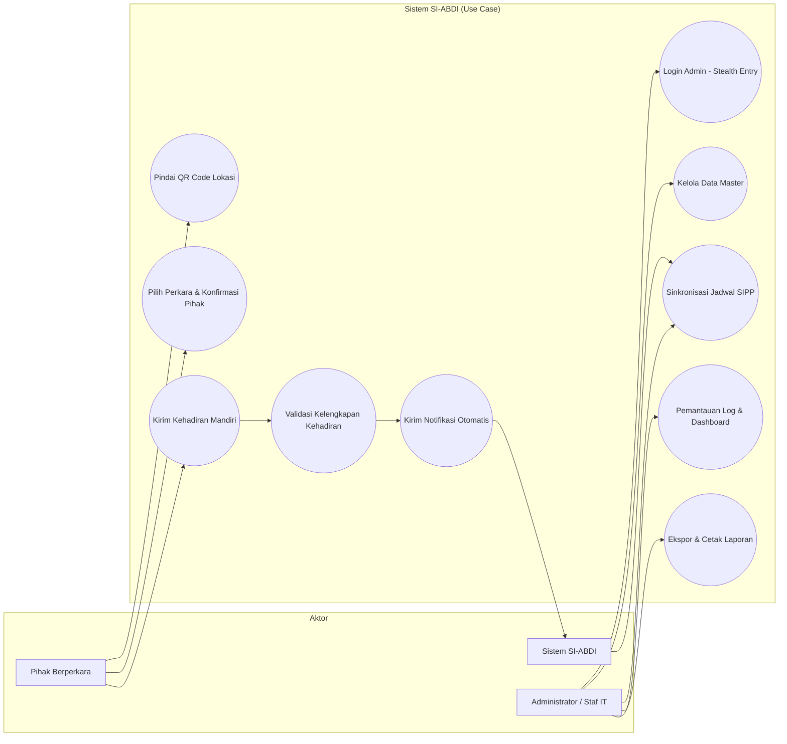
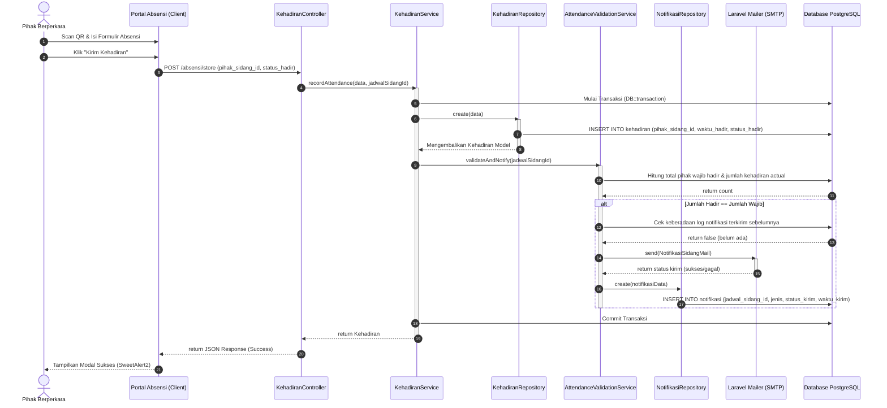
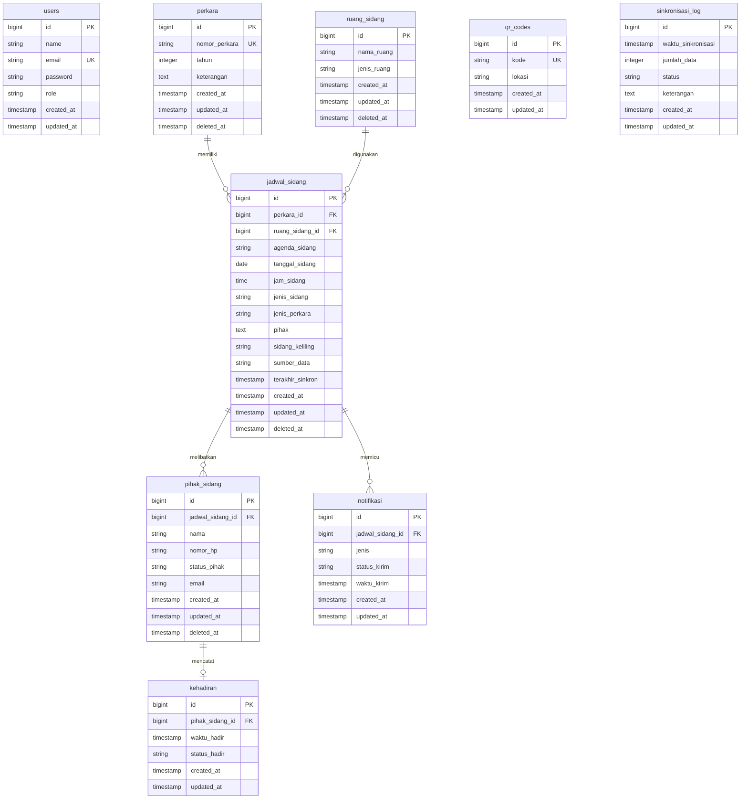

# 4.5 Perancangan Sistem

Perancangan sistem merupakan tahapan krusial untuk memetakan kebutuhan fungsional ke dalam komponen teknis yang akan diimplementasikan. Pada bagian ini, akan dibahas mengenai rancangan aliran kerja, relasi database, diagram aktivitas, serta rancangan basis data PostgreSQL yang diterapkan pada aplikasi **SI-ABDI** (Sistem Absensi Mandiri & Monitoring Kehadiran Pihak Persidangan).

---

### 4.5.1 Gambaran Umum Sistem

Sistem Aplikasi SI-ABDI dirancang untuk mendigitalisasi proses pelaporan kehadiran pihak persidangan secara mandiri (*self-service*) di Pengadilan Tata Usaha Negara (PTUN) Bandar Lampung. Sistem ini menghubungkan tiga komponen utama:
1. **Portal Publik Absensi Mandiri (Zero Login)**: Pihak berperkara (Penggugat, Tergugat, Saksi, Kuasa Hukum, dll.) cukup memindai QR Code di area pengadilan untuk secara otomatis diarahkan ke URL website absensi mandiri. Tanpa perlu akun login, sistem langsung menampilkan daftar jadwal persidangan harian. Pihak hanya perlu memilih nomor perkara dan nama mereka untuk melakukan konfirmasi kehadiran.
2. **Mesin Validasi & Notifikasi Otomatis (`AttendanceValidationService`)**: Setiap kali ada satu pihak yang mengirimkan kehadiran, sistem secara real-time memeriksa apakah seluruh pihak yang wajib hadir untuk jadwal sidang tersebut sudah lengkap berada di area pengadilan. Ketika kelengkapan kehadiran mencapai 100%, sistem secara otomatis mengirimkan notifikasi siap sidang melalui Email/WhatsApp Gateway langsung ke Majelis Hakim dan Panitera Pengganti (PP) yang bertugas.
3. **Modul Integrasi SIPP (`SippSyncService`)**: Modul latar belakang yang melakukan *crawling* terjadwal terhadap data persidangan dari basis data SIPP PTUN Bandar Lampung untuk jadwal sidang hingga 10 hari ke depan, mengeliminasi entri data ganda (*double entry*) oleh administrator.
4. **Dasbor Backoffice Admin**: Antarmuka bagi administrator untuk mengelola data master (Perkara, Ruang Sidang, QR Code), memantau log pengiriman notifikasi, melihat riwayat sinkronisasi SIPP, serta mengunduh laporan rekapitulasi absensi dalam format PDF/Excel.

---

### 4.5.2 Use Case Diagram

Diagram Use Case menggambarkan interaksi antara aktor (Pihak Berperkara, Administrator, dan Sistem) dengan fungsionalitas utama yang disediakan oleh aplikasi SI-ABDI.



---

### 4.5.3 Deskripsi Use Case

Berikut adalah deskripsi rinci dari use case utama yang diimplementasikan pada aplikasi SI-ABDI:

#### 1. Use Case: Absensi Mandiri Pihak
* **Aktor Utama**: Pihak Berperkara
* **Deskripsi**: Aktor melaporkan kehadirannya secara mandiri menggunakan perangkat ponsel pintar (*smartphone*) dengan memindai QR Code yang berada di area PTUN Bandar Lampung.
* **Kondisi Awal (Pre-condition)**: Data jadwal sidang hari ini telah disinkronkan dari SIPP. QR Code fisik telah terpasang di lokasi pengadilan.
* **Kondisi Akhir (Post-condition)**: Kehadiran pihak tersimpan di database dan memicu pengecekan kelengkapan kehadiran.
* **Skenario Alur Utama**:
  1. Pihak memindai QR Code menggunakan kamera ponsel.
  2. Ponsel mengarahkan ke halaman Portal Absensi Publik SI-ABDI (/absensi).
  3. Sistem memuat daftar nomor perkara yang dijadwalkan sidang pada hari tersebut.
  4. Pihak memilih nomor perkara mereka.
  5. Sistem menampilkan daftar nama pihak yang wajib hadir untuk perkara tersebut.
  6. Pihak memilih nama mereka, melakukan konfirmasi nomor WhatsApp/Email, lalu menekan tombol "Kirim Kehadiran".
  7. Sistem mencatat waktu kehadiran di database dan menampilkan notifikasi sukses menggunakan SweetAlert2.

#### 2. Use Case: Validasi & Pengiriman Notifikasi
* **Aktor Utama**: Sistem SI-ABDI
* **Deskripsi**: Sistem mendeteksi kelengkapan pihak sidang secara otomatis setelah absensi baru masuk, dan mengirimkan notifikasi ke Majelis Hakim & Panitera Pengganti (PP) apabila seluruh pihak wajib telah hadir.
* **Kondisi Awal (Pre-condition)**: Pihak berperkara berhasil mengirimkan kehadiran mandiri.
* **Kondisi Akhir (Post-condition)**: Notifikasi dikirimkan ke kontak Majelis Hakim/PP dan terekam di log notifikasi.
* **Skenario Alur Utama**:
  1. Sistem menerima input absensi baru dari Pihak Berperkara.
  2. Sistem menghitung jumlah total pihak yang diwajibkan hadir pada jadwal sidang terkait (`totalWajibHadir`).
  3. Sistem menghitung jumlah pihak yang status kehadirannya sudah tercatat (`totalSudahHadir`).
  4. Sistem membandingkan kedua jumlah tersebut. Jika `totalSudahHadir === totalWajibHadir`:
     - Sistem memeriksa apakah notifikasi kehadiran lengkap untuk jadwal tersebut sudah pernah terkirim.
     - Jika belum pernah, sistem menyusun draf notifikasi sidang siap dimulai.
     - Sistem mengirimkan email notifikasi kepada Majelis Hakim dan PP terkait.
     - Sistem menyimpan log pengiriman di tabel `notifikasi` dengan status `terkirim`.
  5. Jika jumlah kehadiran belum lengkap, sistem tidak mengirimkan notifikasi dan status absensi tetap menunggu pihak lain.

#### 3. Use Case: Sinkronisasi Jadwal SIPP
* **Aktor Utama**: Administrator / Sistem (Cron/Command)
* **Deskripsi**: Menyelaraskan basis data jadwal sidang lokal dengan data SIPP PTUN Bandar Lampung.
* **Kondisi Awal (Pre-condition)**: Koneksi internet aktif ke server SIPP PTUN Bandar Lampung.
* **Kondisi Akhir (Post-condition)**: Jadwal persidangan terbarui di database lokal.
* **Skenario Alur Utama**:
  1. Administrator menekan tombol "Sinkronisasi SIPP" pada dashboard admin (atau dijalankan otomatis melalui task scheduler).
  2. Layanan `SippSyncService` mengirimkan HTTP request ke portal SIPP.
  3. Sistem mengurai data HTML menggunakan Symfony DomCrawler.
  4. Sistem mengekstrak Nomor Perkara, Agenda Sidang, Tanggal, Jam, dan Ruang Sidang.
  5. Sistem mencocokkan nomor perkara. Jika belum ada di database lokal, data perkara baru akan dibuat.
  6. Data jadwal sidang disimpan atau diperbarui.
  7. Sistem merekam log sinkronisasi ke tabel `sinkronisasi_log`.

---

### 4.5.4 Activity Diagram Absensi

Diagram ini menggambarkan alur aktivitas pihak berperkara ketika melakukan absensi mandiri dari awal pemindaian QR Code hingga pencatatan berhasil.

```mermaid
|Pihak Berperkara|
start
:Datang ke area PTUN Bandar Lampung;
:Memindai QR Code (di area pengadilan);

|Sistem SI-ABDI|
:Mengalihkan ke URL website Portal Absensi;
:Memuat daftar jadwal persidangan aktif hari ini;
:Menampilkan halaman Portal Absensi Publik;

|Pihak Berperkara|
:Memilih Nomor Perkara sidang;
:Memilih Nama Pihak (identitas pengabsen);
:Mengonfirmasi nomor WhatsApp/Email;
:Klik tombol "Kirim Kehadiran";

|Sistem SI-ABDI|
:Validasi input form absensi;
:Menyimpan data kehadiran ke database;
:Memicu validasi kelengkapan kehadiran;
:Menampilkan visualisasi sukses (SweetAlert2);
stop
```

---

### 4.5.5 Activity Diagram Monitoring

Diagram aktivitas berikut menunjukkan bagaimana administrator melakukan login tersembunyi dan melakukan pengawasan aktivitas persidangan serta mengunduh laporan.

```mermaid
|Administrator|
start
:Membuka halaman utama SI-ABDI;
:Mengklik ikon hak cipta © di footer halaman (Stealth Entry);

|Sistem SI-ABDI|
:Membuka formulir autentikasi login tersembunyi;

|Administrator|
:Memasukkan Email dan Password Admin;
:Klik "Login";

|Sistem SI-ABDI|
:Validasi kredensial login;
if (Kredensial Valid?) then (Ya)
    :Mengarahkan ke Dashboard Backoffice;
    :Memuat analitik tren kehadiran & diagram Chart.js;
else (Tidak)
    :Tampilkan pesan error password salah;
    stop
endif

|Administrator|
:Memilih salah satu menu monitoring;
split
    :Pilih menu Log Notifikasi;
    :Melihat status pengiriman email/WA persidangan;
split type/parallel
    :Pilih menu Sinkronisasi SIPP;
    :Menekan tombol picu sinkronisasi terjadwal manual;
split type/parallel
    :Pilih menu Laporan Kehadiran;
    :Memasukkan filter tanggal & ruang sidang;
    :Klik tombol "Ekspor PDF" atau "Ekspor Excel";
end split
stop
```

---

### 4.5.6 Activity Diagram Notifikasi Panggilan WhatsApp

Diagram ini menunjukkan alur logika pengiriman notifikasi panggilan persidangan melalui WhatsApp dan Email saat Administrator mengklik tombol "Panggil Pihak" di dasbor admin.

```mermaid
|Administrator|
start
:Mengklik tombol "Panggil Pihak" pada Dashboard;

|Sistem SI-ABDI|
:Menerima request panggil pihak (jadwal_sidang_id);
:Memuat data Jadwal Persidangan, Perkara, Pihak, dan Ruang Sidang;
:Menyaring daftar Pihak Sidang yang statusnya sudah hadir (kehadiran != null);

if (Apakah ada pihak yang sudah hadir?) then (Tidak)
    :Tampilkan pesan error "Belum ada pihak yang melakukan absensi hadir";
    :Redirect kembali ke halaman dashboard;
    stop
else (Ya)
    :Inisialisasi counter waSuccess = 0 dan emailSuccess = 0;
    
    repeat
        :Pilih entitas pihak sidang berikutnya yang hadir;
        
        if (Apakah nomor HP tersedia?) then (Ya)
            :Susun template pesan panggilan WhatsApp;
            :Panggil WhatsAppNotificationService->sendNotification();
            
            |WhatsAppNotificationService|
            :Bersihkan format nomor (ganti awalan 0 menjadi 62);
            :Kirim POST API Request ke Twilio API Gateway;
            
            if (API Gateway Sukses?) then (Ya)
                :Set status_kirim = 'terkirim';
                :waSuccess++;
            else (Tidak)
                :Set status_kirim = 'gagal';
            endif
            
            |Sistem SI-ABDI|
            :Simpan log notifikasi WhatsApp ke database (tabel notifikasi);
        else (Tidak)
        endif
        
        if (Apakah alamat email tersedia?) then (Ya)
            :Kirim email panggilan (PanggilanSidangMail);
            if (Email Sukses Terkirim?) then (Ya)
                :emailSuccess++;
                :Simpan log notifikasi Email 'terkirim' ke database;
            else (Tidak)
                :Simpan log notifikasi Email 'gagal' ke database;
            endif
        else (Tidak)
        endif
        
    until (Semua pihak yang hadir selesai diproses);
    
    :Redirect kembali ke halaman dashboard;
    :Tampilkan alert sukses "Panggilan berhasil dikirim ke para pihak";
    stop
endif
```


---

### 4.5.7 Sequence Diagram Absensi

Diagram urutan (*Sequence Diagram*) di bawah ini menggambarkan interaksi antarkomponen perangkat lunak saat pihak mengirimkan data kehadiran hingga notifikasi terkirim.



---

### 4.5.8 Entity Relationship Diagram (ERD)

Berikut adalah Entity Relationship Diagram (ERD) fisik yang merepresentasikan skema tabel yang diimplementasikan secara riil di dalam database PostgreSQL aplikasi SI-ABDI.

> [!NOTE]
> Struktur ini merupakan skema aktual sesuai dengan file migrasi database proyek. Data penugasan hakim dan panitera pengganti diintegrasikan secara dinamis ke dalam detail entitas jadwal sidang untuk absensi mandiri publik.



---

### 4.5.9 Relasi Antar Tabel

Penjelasan hubungan keterkaitan antarentitas tabel dalam sistem SI-ABDI adalah sebagai berikut:
1. **Relasi `perkara` dengan `jadwal_sidang` (One-to-Many)**: Satu perkara hukum dapat disidangkan beberapa kali (memiliki beberapa agenda persidangan di waktu berbeda), namun satu entri jadwal persidangan hanya merujuk pada satu perkara persidangan yang sah. Relasi diatur oleh kunci asing `perkara_id` pada tabel `jadwal_sidang`.
2. **Relasi `ruang_sidang` dengan `jadwal_sidang` (One-to-Many)**: Satu ruang sidang di kantor PTUN dapat dipakai secara bergantian untuk melaksanakan banyak jadwal persidangan. Sebaliknya, satu jadwal sidang hanya dialokasikan di satu ruangan sidang spesifik. Dihubungkan via kunci asing `ruang_sidang_id` pada tabel `jadwal_sidang`.
3. **Relasi `jadwal_sidang` dengan `pihak_sidang` (One-to-Many)**: Satu agenda jadwal persidangan melibatkan beberapa aktor berperkara wajib hadir (Penggugat, Tergugat, Saksi, dll.). Entri nama pihak di dalam tabel ini terikat eksklusif ke satu jadwal sidang terkait via kunci asing `jadwal_sidang_id`.
4. **Relasi `jadwal_sidang` dengan `notifikasi` (One-to-Many)**: Satu jadwal sidang dapat memicu beberapa riwayat pengiriman notifikasi (misalnya log notifikasi email pertama gagal lalu dicoba ulang, atau notifikasi lain). Relasi dihubungkan melalui kunci asing `jadwal_sidang_id` di tabel `notifikasi`.
5. **Relasi `pihak_sidang` dengan `kehadiran` (One-to-One / One-to-Zero)**: Satu entitas pihak sidang yang terdaftar hanya dapat mencatatkan kehadirannya maksimal satu kali pada jadwal persidangan tersebut. Dihubungkan via kunci asing `pihak_sidang_id` pada tabel `kehadiran` yang bersifat unik.
6. **Entitas Tanpa Relasi Langsung (`qr_codes` & `sinkronisasi_log`)**:
   - Tabel `qr_codes` menyimpan parameter kode unik dan nama lokasi fisik pemindaian yang diolah secara dinamis pada backend logika validasi rute absensi publik.
   - Tabel `sinkronisasi_log` mencatat riwayat performa eksekusi sinkronisasi otomatis dari SIPP untuk kebutuhan audit sistem IT.

---

### 4.5.10 Struktur Database PostgreSQL

Di bawah ini adalah rancangan kamus data (*data dictionary*) mendalam untuk setiap tabel yang ada di dalam database PostgreSQL aplikasi SI-ABDI:

#### 1. Tabel: `users`
Digunakan untuk menyimpan data kredensial akun pengguna administrator dan petugas pengadilan.

| Nama Kolom | Tipe Data | Atribut / Constraints | Keterangan |
| :--- | :--- | :--- | :--- |
| `id` | bigint | PRIMARY KEY, AUTO_INCREMENT | ID unik akun pengguna |
| `name` | varchar(255) | NOT NULL | Nama lengkap pengguna |
| `email` | varchar(255) | UNIQUE, NOT NULL | Alamat email (digunakan untuk login) |
| `email_verified_at`| timestamp | NULLABLE | Waktu verifikasi email |
| `password` | varchar(255) | NOT NULL | Hash kata sandi akun |
| `role` | varchar(50) | NOT NULL | Hak akses peran pengguna (misal: 'admin') |
| `remember_token` | varchar(100) | NULLABLE | Token sesi login persisten |
| `created_at` | timestamp | NULLABLE | Waktu data dibuat |
| `updated_at` | timestamp | NULLABLE | Waktu data diubah |

#### 2. Tabel: `perkara`
Menyimpan data master berkas perkara persidangan yang terdaftar.

| Nama Kolom | Tipe Data | Atribut / Constraints | Keterangan |
| :--- | :--- | :--- | :--- |
| `id` | bigint | PRIMARY KEY, AUTO_INCREMENT | ID unik perkara |
| `nomor_perkara` | varchar(255) | UNIQUE, NOT NULL | Nomor registrasi perkara di pengadilan |
| `tahun` | integer | NOT NULL | Tahun pendaftaran perkara |
| `keterangan` | text | NULLABLE | Catatan tambahan mengenai perkara |
| `created_at` | timestamp | NULLABLE | Waktu data dibuat |
| `updated_at` | timestamp | NULLABLE | Waktu data diubah |
| `deleted_at` | timestamp | NULLABLE (SOFT_DELETES) | Waktu data dihapus secara logis |

#### 3. Tabel: `ruang_sidang`
Menyimpan daftar ruangan sidang fisik yang tersedia di PTUN Bandar Lampung.

| Nama Kolom | Tipe Data | Atribut / Constraints | Keterangan |
| :--- | :--- | :--- | :--- |
| `id` | bigint | PRIMARY KEY, AUTO_INCREMENT | ID unik ruang sidang |
| `nama_ruang` | varchar(255) | NOT NULL | Nama ruang sidang (misal: 'Ruang Sidang Utama') |
| `jenis_ruang` | varchar(100) | NOT NULL | Jenis atau tipe ruang persidangan |
| `created_at` | timestamp | NULLABLE | Waktu data dibuat |
| `updated_at` | timestamp | NULLABLE | Waktu data diubah |
| `deleted_at` | timestamp | NULLABLE (SOFT_DELETES) | Waktu data dihapus secara logis |

#### 4. Tabel: `jadwal_sidang`
Menyimpan jadwal persidangan harian hasil sinkronisasi SIPP atau entri manual.

| Nama Kolom | Tipe Data | Atribut / Constraints | Keterangan |
| :--- | :--- | :--- | :--- |
| `id` | bigint | PRIMARY KEY, AUTO_INCREMENT | ID unik jadwal persidangan |
| `perkara_id` | bigint | FOREIGN KEY (`perkara.id`), ON DELETE CASCADE | ID perkara terkait |
| `ruang_sidang_id` | bigint | FOREIGN KEY (`ruang_sidang.id`), ON DELETE CASCADE | ID lokasi ruang sidang |
| `agenda_sidang` | varchar(255) | NOT NULL | Agenda persidangan (misal: 'Pembuktian') |
| `tanggal_sidang` | date | NOT NULL | Tanggal pelaksanaan persidangan |
| `jam_sidang` | time | NOT NULL | Jam pelaksanaan persidangan |
| `jenis_sidang` | varchar(50) | NOT NULL | Metode persidangan (Offline / Online) |
| `jenis_perkara` | varchar(255) | NULLABLE | Klasifikasi perkara persidangan |
| `pihak` | text | NULLABLE | Detail teks data pihak wajib hadir |
| `sidang_keliling` | varchar(255) | NULLABLE | Informasi persidangan di luar kantor pengadilan |
| `sumber_data` | varchar(50) | NULLABLE | Sumber data jadwal (misal: 'SIPP', 'Manual') |
| `terakhir_sinkron`| timestamp | NULLABLE | Waktu terakhir kali disinkronkan |
| `created_at` | timestamp | NULLABLE | Waktu data dibuat |
| `updated_at` | timestamp | NULLABLE | Waktu data diubah |
| `deleted_at` | timestamp | NULLABLE (SOFT_DELETES) | Waktu data dihapus secara logis |

#### 5. Tabel: `pihak_sidang`
Menyimpan daftar nama individu/pihak yang wajib menghadiri suatu jadwal persidangan.

| Nama Kolom | Tipe Data | Atribut / Constraints | Keterangan |
| :--- | :--- | :--- | :--- |
| `id` | bigint | PRIMARY KEY, AUTO_INCREMENT | ID unik pihak sidang |
| `jadwal_sidang_id`| bigint | FOREIGN KEY (`jadwal_sidang.id`), ON DELETE CASCADE | ID jadwal sidang terkait |
| `nama` | varchar(255) | NOT NULL | Nama lengkap pihak |
| `nomor_hp` | varchar(50) | NOT NULL | Nomor telepon/WhatsApp pihak |
| `status_pihak` | varchar(100) | NOT NULL | Peran pihak (Penggugat, Tergugat, Kuasa Hukum, dll.) |
| `email` | varchar(255) | NULLABLE | Alamat email pihak untuk notifikasi |
| `created_at` | timestamp | NULLABLE | Waktu data dibuat |
| `updated_at` | timestamp | NULLABLE | Waktu data diubah |
| `deleted_at` | timestamp | NULLABLE (SOFT_DELETES) | Waktu data dihapus secara logis |

#### 6. Tabel: `qr_codes`
Menyimpan kode identifikasi QR Code dan lokasi penempatan fisiknya.

| Nama Kolom | Tipe Data | Atribut / Constraints | Keterangan |
| :--- | :--- | :--- | :--- |
| `id` | bigint | PRIMARY KEY, AUTO_INCREMENT | ID unik QR Code |
| `kode` | varchar(255) | UNIQUE, NOT NULL | String unik kode QR (misal: 'LOBBY-01') |
| `lokasi` | varchar(255) | NOT NULL | Posisi fisik penempelan QR Code (misal: 'Pos Satpam') |
| `created_at` | timestamp | NULLABLE | Waktu data dibuat |
| `updated_at` | timestamp | NULLABLE | Waktu data diubah |

#### 7. Tabel: `notifikasi`
Menyimpan log pengiriman notifikasi otomatis yang ditujukan kepada Majelis Hakim/PP.

| Nama Kolom | Tipe Data | Atribut / Constraints | Keterangan |
| :--- | :--- | :--- | :--- |
| `id` | bigint | PRIMARY KEY, AUTO_INCREMENT | ID unik log notifikasi |
| `jadwal_sidang_id`| bigint | FOREIGN KEY (`jadwal_sidang.id`), ON DELETE CASCADE | ID jadwal sidang yang memicu notifikasi |
| `jenis` | varchar(50) | NOT NULL | Media kirim notifikasi (Email / WhatsApp) |
| `status_kirim` | varchar(50) | NOT NULL | Status kirim ('pending', 'terkirim', 'gagal') |
| `waktu_kirim` | timestamp | NULLABLE | Waktu eksekusi pengiriman pesan |
| `created_at` | timestamp | NULLABLE | Waktu data dibuat |
| `updated_at` | timestamp | NULLABLE | Waktu data diubah |

#### 8. Tabel: `kehadiran`
Menyimpan rekaman presensi fisik para pihak yang melakukan absensi mandiri.

| Nama Kolom | Tipe Data | Atribut / Constraints | Keterangan |
| :--- | :--- | :--- | :--- |
| `id` | bigint | PRIMARY KEY, AUTO_INCREMENT | ID unik rekaman kehadiran |
| `pihak_sidang_id` | bigint | FOREIGN KEY (`pihak_sidang.id`), ON DELETE CASCADE | ID pihak yang hadir |
| `waktu_hadir` | timestamp | NOT NULL | Waktu tepat pihak melakukan check-in |
| `status_hadir` | varchar(50) | NOT NULL | Keterangan status kehadiran (misal: 'hadir') |
| `created_at` | timestamp | NULLABLE | Waktu data dibuat |
| `updated_at` | timestamp | NULLABLE | Waktu data diubah |

#### 9. Tabel: `sinkronisasi_log`
Menyimpan catatan riwayat aktivitas dan status sinkronisasi terjadwal dari SIPP.

| Nama Kolom | Tipe Data | Atribut / Constraints | Keterangan |
| :--- | :--- | :--- | :--- |
| `id` | bigint | PRIMARY KEY, AUTO_INCREMENT | ID unik log sinkronisasi |
| `waktu_sinkronisasi`| timestamp | NOT NULL | Waktu eksekusi sinkronisasi |
| `jumlah_data` | integer | NOT NULL | Jumlah record jadwal sidang baru yang disinkronisasi |
| `status` | varchar(50) | NOT NULL | Hasil sinkronisasi ('berhasil', 'gagal') |
| `keterangan` | text | NULLABLE | Pesan sukses atau detail kesalahan/error sistem |
| `created_at` | timestamp | NULLABLE | Waktu data dibuat |
| `updated_at` | timestamp | NULLABLE | Waktu data diubah |

---

### 4.5.11 Perancangan Antarmuka
Tata letak visual dirancang dengan struktur responsif (Bootstrap 5) bertema Emerald Green:

##### a. Halaman Beranda
Antarmuka publik yang minimalis dan bersih, menampilkan instruksi pemindaian QR Code di pengadilan. Tombol login admin tersembunyi pada simbol copyright `©` (ditandai dengan `[*]`) di footer.

```text
+-------------------------------------------------------------------------------+
| [Logo] SI-ABDI | Pengadilan Tata Usaha Negara Bandar Lampung                  |
+-------------------------------------------------------------------------------+
|                                                                               |
|                      SISTEM ABSENSI MANDIRI & MONITORING                      |
|                       KEHADIRAN PIHAK PERSIDANGAN                             |
|                                                                               |
|   +-----------------------------------------------------------------------+   |
|   |                       ALUR ABSENSI MANDIRI (3 LANGKAH)                |   |
|   |                                                                       |   |
|   |  [ 1. Scan QR ] --------> [ 2. Pilih Perkara ] --------> [ 3. Kirim ]  |   |
|   |  Scan QR Code di area     Pilih No. Perkara & Nama      Masukkan No.  |   |
|   |  Pengadilan (Pos Satpam)  Anda pada list dropdown       WA & kirim    |   |
|   +-----------------------------------------------------------------------+   |
|                                                                               |
|   +-----------------------------------------------------------------------+   |
|   |                       INFORMASI & PETUNJUK                            |   |
|   |  1. Silakan lakukan absensi mandiri segera setelah Anda tiba di       |   |
|   |     area Pengadilan Tata Usaha Negara Bandar Lampung.                 |   |
|   |  2. Siapkan nomor perkara dan nomor WhatsApp aktif Anda.              |   |
|   |  3. Hubungi petugas piket/satpam jika terjadi kendala teknis.         |   |
|   +-----------------------------------------------------------------------+   |
|                                                                               |
+-------------------------------------------------------------------------------+
|  (c) 2026 PTUN Bandar Lampung. All Rights Reserved.                       [*] |
+-------------------------------------------------------------------------------+
```
*(Catatan UX: Tanda `[*]` pada pojok kanan bawah footer merupakan tautan tersembunyi (Stealth Admin Entry) untuk mengakses Halaman Login Administrator).*

##### b. Halaman Absensi
Formulir pengisian kehadiran mandiri yang menampilkan lokasi pindaian, dropdown nomor perkara sidang hari ini, daftar nama pihak wajib, input nomor WhatsApp, dan tombol "Kirim Kehadiran".

```text
+-------------------------------------------------------------------------------+
| [Logo] SI-ABDI | Pengadilan Tata Usaha Negara Bandar Lampung                  |
+-------------------------------------------------------------------------------+
|                                                                               |
|                       PORTAL ABSENSI MANDIRI PIHAK                            |
|                       ----------------------------                            |
|                       Lokasi Pindai: [ POS SATPAM - 01 ]                      |
|                                                                               |
|   +-----------------------------------------------------------------------+   |
|   |  FORMULIR PRESENSI SIDANG HARI INI                                    |   |
|   |                                                                       |   |
|   |  1. Pilih Perkara Anda (Hanya memuat sidang hari ini):                |   |
|   |     [ -- Pilih Nomor Perkara / Agenda Sidang --                     v ]   |
|   |                                                                       |   |
|   |  2. Pilih Nama Anda (Sesuai nama pihak terdaftar):                    |   |
|   |     [ -- Pilih Nama Pihak Berperkara --                             v ]   |
|   |                                                                       |   |
|   |  3. Nomor WhatsApp Aktif (untuk Notifikasi / Panggilan):              |   |
|   |     [ Masukkan nomor WhatsApp Anda (cth: 0812xxxxxxxx)                ]   |
|   |                                                                       |   |
|   |  4. Alamat Email (Opsional):                                          |   |
|   |     [ Masukkan email Anda                                             ]   |
|   |                                                                       |   |
|   |                     [ TOMBOL: KIRIM KEHADIRAN ]                       |   |
|   +-----------------------------------------------------------------------+   |
|                                                                               |
+-------------------------------------------------------------------------------+
|  (c) 2026 PTUN Bandar Lampung. All Rights Reserved.                       [*] |
+-------------------------------------------------------------------------------+
```

##### c. Halaman Dashboard
Halaman utama administrator yang memuat kartu analitik ringkasan data (Total Perkara, Jadwal Hari Ini, Pihak Hadir, Notifikasi Terkirim) serta grafik batang statistik Chart.js tren mingguan kehadiran.

```text
+-------------------------------------------------------------------------------+
| [=] SI-ABDI | BACKOFFICE ADMIN                 [Halo, Admin IT v] [Logout]     |
+-------------------------------------------------------------------------------+
| [Sidebar Nav]   | DASHBOARD UTAMA                                             |
|                 |                                                             |
| [x] Dashboard   | +------------+ +------------+ +------------+ +------------+ |
| [ ] Perkara     | |Tot Perkara | |Sidang Hari | |Pihak Hadir | |Notif Sent  | |
| [ ] Jadwal      | |    142     | |     18     | |   32/36    | |    15      | |
| [ ] Monitoring  | +------------+ +------------+ +------------+ +------------+ |
| [ ] Logs Notif  |                                                             |
| [ ] Users       | +---------------------------------------------------------+ |
| [ ] Sync SIPP   | | GRAFIK TREN KEHADIRAN PIHAK (7 HARI TERAKHIR)           | |
|                 | |                                                         | |
|                 | | Vol                                                     | |
|                 | |  40|      _      _                                      | |
|                 | |  30|     | |    | |     _          _                    | |
|                 | |  20|     | |    | |    | |   _    | |   _               | |
|                 | |  10|     | |    | |    | |  | |   | |  | |              | |
|                 | |   0+-----+------+------+----+-----+----+------>          | |
|                 | |         Sen    Sel    Rab  Kam   Jum  Sab               | |
|                 | +---------------------------------------------------------+ |
+-------------------------------------------------------------------------------+
```

##### d. Halaman Data Perkara
Tabel data master perkara dengan kolom nomor perkara, tahun, keterangan, aksi edit, hapus (Soft Deletes), dan tambah data perkara baru.

```text
+-------------------------------------------------------------------------------+
| [=] SI-ABDI | BACKOFFICE ADMIN                 [Halo, Admin IT v] [Logout]     |
+-------------------------------------------------------------------------------+
| [Sidebar Nav]   | DATA MASTER PERKARA                                         |
|                 |                                                             |
| [ ] Dashboard   | [ Search Nomor Perkara... ]         [+ Tambah Perkara Baru] |
| [x] Perkara     |                                                             |
| [ ] Jadwal      | +---------------------------------------------------------+ |
| [ ] Monitoring  | | No | Nomor Perkara    | Tahun | Keterangan  | Aksi      | |
| [ ] Logs Notif  | +----+------------------+-------+-------------+-----------+ |
| [ ] Users       | | 1  | 12/G/2026/PTUN.BL| 2026  | Sengketa TUN| [Edit][Del]| |
| [ ] Sync SIPP   | | 2  | 15/G/2026/PTUN.BL| 2026  | Kepegawaian | [Edit][Del]| |
|                 | | 3  | 21/G/2026/PTUN.BL| 2026  | Sengketa IP | [Edit][Del]| |
|                 | +----+------------------+-------+-------------+-----------+ |
|                 | Menampilkan 1-3 dari 142 data             [<<] [1] [2] [>>] |
+-------------------------------------------------------------------------------+
```

##### e. Halaman Jadwal Sidang
Halaman pengelolaan jadwal sidang lengkap dengan detail perkara, waktu, agenda, ruang sidang, jenis sidang, tombol edit/hapus, serta tombol khusus "Panggil Pihak".

```text
+-------------------------------------------------------------------------------+
| [=] SI-ABDI | BACKOFFICE ADMIN                 [Halo, Admin IT v] [Logout]     |
+-------------------------------------------------------------------------------+
| [Sidebar Nav]   | JADWAL SIDANG & PANGGILAN                                   |
|                 |                                                             |
| [ ] Dashboard   | [ Filter Tanggal: Hari Ini ]   [ Sync SIPP ]   [+ Tambah]   |
| [ ] Perkara     |                                                             |
| [x] Jadwal      | +---------------------------------------------------------+ |
| [ ] Monitoring  | | No | Perkara   | Ruang  | Jam   | Pihak & Status  | Aksi| |
| [ ] Logs Notif  | +----+-----------+--------+-------+-----------------+-----+ |
| [ ] Users       | | 1  | 12/G/...  | Utama  | 09:00 | P: Hadir  | T: -  |[Pgl]| |
| [ ] Sync SIPP   | | 2  | 15/G/...  | Kartika| 10:00 | P: Hadir  | T: Hdr|[Pgl]| |
|                 | | 3  | 21/G/...  | Cakra  | 11:15 | P: -      | T: -  |[Pgl]| |
|                 | +----+-----------+--------+-------+-----------------+-----+ |
|                 | * Kolom Status diupdate real-time.                          | |
|                 | * Tombol [Pgl] (Panggil) mengirim broadcast WhatsApp manual.| |
+-------------------------------------------------------------------------------+
```

##### f. Halaman Monitoring Kehadiran
Halaman pemantauan real-time ("Daftar Hadir Hari Ini") yang menyajikan persentase tingkat kehadiran para pihak berperkara yang sedang disidangkan pada hari tersebut.

##### g. Halaman Log Notifikasi
Halaman rekapitulasi logs status pengiriman pemberitahuan (Email / WhatsApp Gateway) lengkap dengan status 'terkirim' atau 'gagal' beserta detail waktu kirim.

##### h. Halaman Manajemen User
Antarmuka untuk menambah, mengedit, dan menghapus akun administrator/petugas pengadilan yang memiliki wewenang masuk ke dashboard backend.
